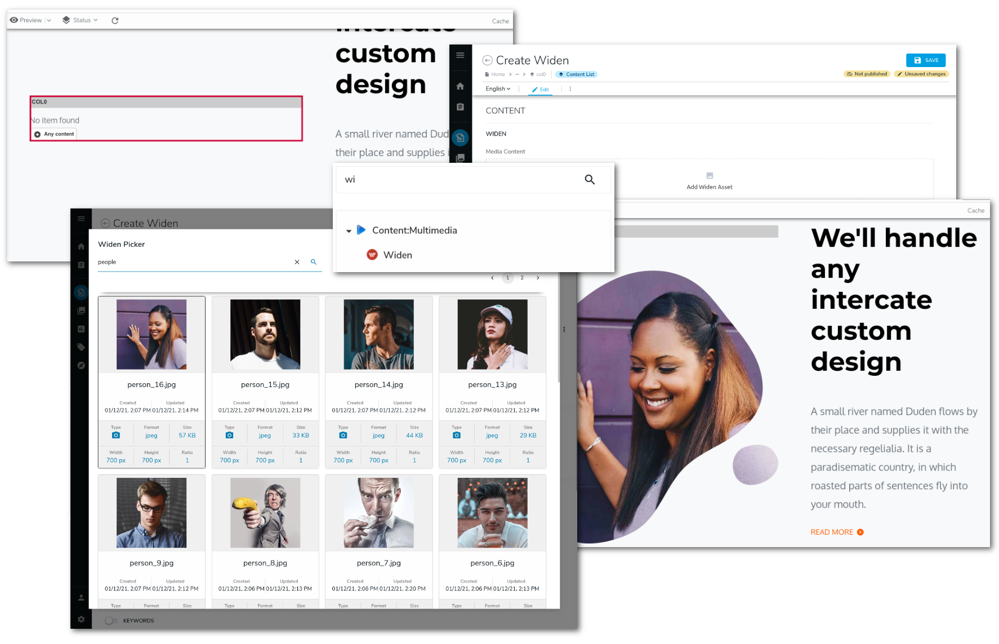
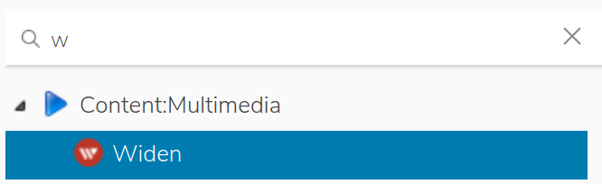

# widen-asset-picker

This module contains the implementation of the Widen Content Picker for Jahia v7.3.x.

With this module, a contributor can easily add a widen media asset to a jahia page.




- [Module content](#module-content)
- [Quick Start](#quick-start)
- [Module details](#module-details)
    - [Data flow](#data-flow)
    - [Widen assets in jContent](#widen-assets-in-jcontent)
    - [Widen Picker](#widen-picker)
    - [Widen Provider](#widen-provider)


## Module content

This module contains :
1. The definition of a `Widen Reference` content ([definition.cnd][definition.cnd]).
1. A React application named `Widen Picker` ([index.js][react:index.js]).
    This application is a custom jContent picker and is used to pick a widen asset .
1. A *light* implementation of an External Data Provider (EDP) named
    `Widen Provider` ([WidenDataSource.java]).

Not covered by this module :
1. Ckeditor widen media picker

## Quick Start
### Prerequisites
Before to deploy the module, some adjustment must be done in the jahia.properties file (*digital-factory-config/jahia/jahia.properties*):
1. The size of the `System name` must be greater than the default 32 characters to save a widen asset id in it.

    uncomment line 260 and change value 32 to 64
    ```
    (-) #jahia.jcr.maxNameSize = 32
    (+) jahia.jcr.maxNameSize = 64
   ```
1. Add your widen configuration to the end of file :
    ```properties
    ####
    # Widen Config
    ####
    jahia.widen.api.protocol = <http protocol>
    jahia.widen.api.endPoint = <widen api endpoint>
    jahia.widen.api.site = <your widen site name>
    jahia.widen.api.token = <your widen api token>
    jahia.widen.api.version = <api version>
    jahia.widen.edp.mountPoint = <jContent mount point>
    ```
    For example :
    ```properties
    ####
    # Widen Config
    ####
    jahia.widen.api.protocol = https
    jahia.widen.api.endPoint = api.widencollective.com
    jahia.widen.api.site = acme
    jahia.widen.api.token = ba2d0a71907a17sff9eb9dc1fc91fd3a
    jahia.widen.api.version = v2
    jahia.widen.edp.mountPoint = /sites/systemsite/contents/dam-widen
    ```
   
   > You must restart jContent to have these properties available in the environment.

   > The connector released for jContent v8 use a .cfg file and properties can be hot deployed

### Deploy the module
The module can be installed in 2 ways, from the source or from the store (available soon)
#### From the source
1. Clone or download the zip archive of the latest release.
1. Go to root of the repository
1. Run the command line `mvn clean install`. This create a jar file in the *target* repository
1. From jContent Goto `Administration` mode
1. Expand `System components` entry and click `Modules`
1. From the right panel click `SELECT MODULE`, and select the jar file in the *target* repository
1. Finaly click `UPLOAD` 

    ![][030]

#### From the store
Available soon.

#### Check install
If the module is properly deployed :
1. You should see the `WidenProvider` key in the list of External provider.

    ![][031]

1. You should be able to create a new `Widen Reference` content.

    ![][0011]

## Module details

To pick a widen asset (video, image, pdf...) from a Widen Cloud instance, you need to implement :
1. A *light* External Data Provider (EDP), named `Widen Provider`,
    used to map the JSON returned by the widen API and representing the Widen asset into a Jahia node
1. A React application, named `Widen Picker`, used as a content picker into Jahia. 
    This picker is a user interface (UI) from which a jContent contributor can query a Widen server to find and 
    select the media asset he wants to use on the website.

### Data flow

![][010]

1. The Contributor creates a new `Widen` content (aka as `Widen Reference`).

    
    
    ![0011]
    
    Then jContent displays a contributor form with a field Media Content.

    ![][002]

1. When user click the field *Media Content* in the form above, the React application `Widen Picker` is launch in iframe. 
    By default, lazyload is false, and the application executes an AJAX call to the widen API endpoint to populate the picker -
    [more details here](#widen-picker).
    
    > The picker uses the Widen API : [Assets - List by search query][widenAPI:AssetByQuery].

1. The widen endpoint return a JSON file uses by the app to display the search contents. Now the user can refine the search or select a widen asset.

    ![][0041]

1. When the user save its choice from the picker, a content path is returned to jContent. This path is build with the value of `jahia.widen.edp.mountPoint`
    and the `id` of the widen asset.
    
    > jContent checks if this path refers to a jahia node. For that, the path is mapped to a jahia node 
    through the `Widen Provider`.
    
1. If the asset picked is not in the jContent cache, the provider call the widen API endpoint to get all the relevant properties about the asset picked - [more details here](#widen-provider).
        
    > The provider use the Widen API : [Assets - Retrieve by id][widenAPI:AssetById].

1. The JSON response returned by the API is mapped to a jahia node and cached into an ehcache instance named `cacheWiden`.
    By default, This cache is configured to keep the content 8h maximum and to drop the content if it is idle more than 1 hour. 
    
1. If the path provided in step 4 is correct, the provider return a jahia reference node and the contributor can save its `Widen Reference`
    content.
    
    ![][005]
    
1. The content can be used by a jContent Page. This module provides jContent views for different type of widen asset (image, video...).

1. The jContent views use the widen CDN URL (aka as embeds.templated.url property) to get and display the content in webpage.
the use of a Widen CDN guarantees good loading performance as well as the proper functioning of widen statistics.

    ![][0061]
   
### Widen assets in jContent
[Read this dedicated page][contentDefinition.md]
 
### Widen Picker
[Read this dedicated page][picker.md]

### Widen Provider
[Read this dedicated page][provider.md]

### How to handle a new media content created in Widen - example of the audio content type

Thus, if in your Widen Server you create a new media content type like *audio*.
To be able to pick it and store a specific set of metadata related to this type into jContent,
you need a specific node type definition. Also, you will create something like `wdennt:audio`.

To be able to pick this node type from the picker you just need to extend your `wdennt:audio`
node type with the mixin `wdenmix:widenAsset`. Like this, you don't need to touch the definition
of `wdennt:widenReference`)

At this stage, the audio node type definition should looks like :
```cnd
[wdennt:audio] > jnt:content, wdenmix:widenAsset
```

**Note :** you must update the mapping part of the [Widen Provider](#widen-provider)
to have your `wdennt:audio` fully usable in jContent.


[030]: ./doc/images/030_install.png
[031]: ./doc/images/031_install_completed.png
[001]: ./doc/images/001_menu-select.png
[010]: ./doc/images/010_archi.png
[0011]: ./doc/images/0011_menuSelect2.png
[002]: ./doc/images/002_widenReference.png
[0041]: ./doc/images/0041_widenPickerSelected.png
[005]: ./doc/images/005_widenReferenceSelected.png
[0061]: ./doc/images/0061_widenAssetInSite.png

[contentDefinition.md]: ./doc/en/contentDefinition.md
[picker.md]: ./doc/en/picker.md
[provider.md]: ./doc/en/provider.md

[definition.cnd]: ./src/main/resources/META-INF/definitions.cnd
[react:index.js]: ./src/REACT/src/index.js
[WidenDataSource.java]: ./src/main/java/org/jahia/se/modules/widenprovider/WidenDataSource.java

[widenAPI:AssetByQuery]: https://widenv2.docs.apiary.io/#reference/assets/assets/list-by-search-query
[widenAPI:AssetById]: https://widenv2.docs.apiary.io/#reference/assets/assets/retrieve-by-id


