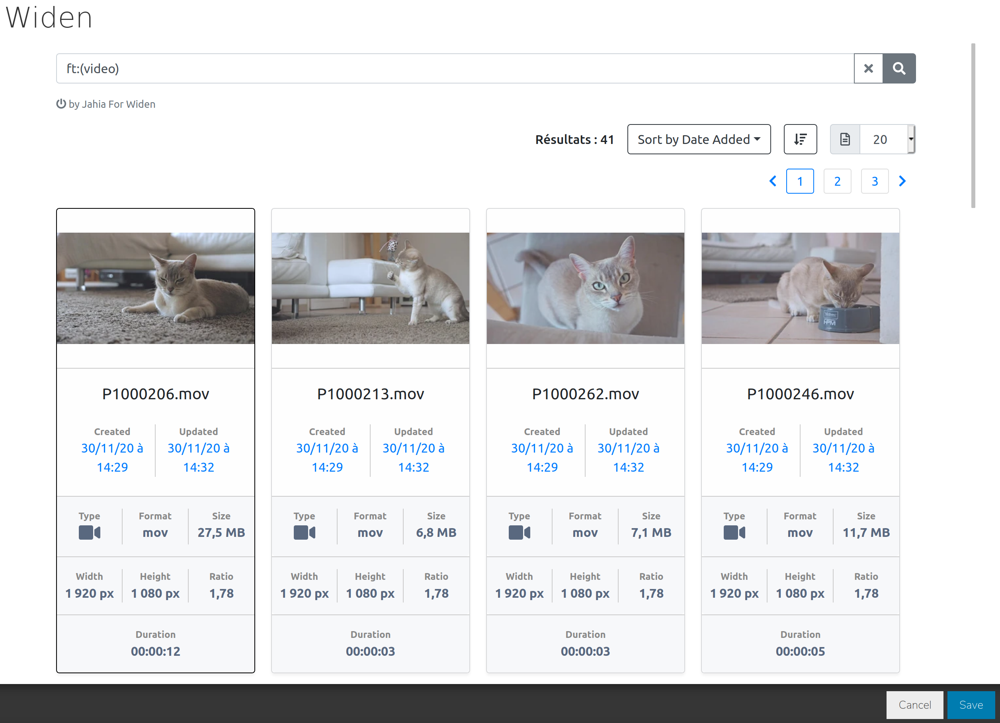
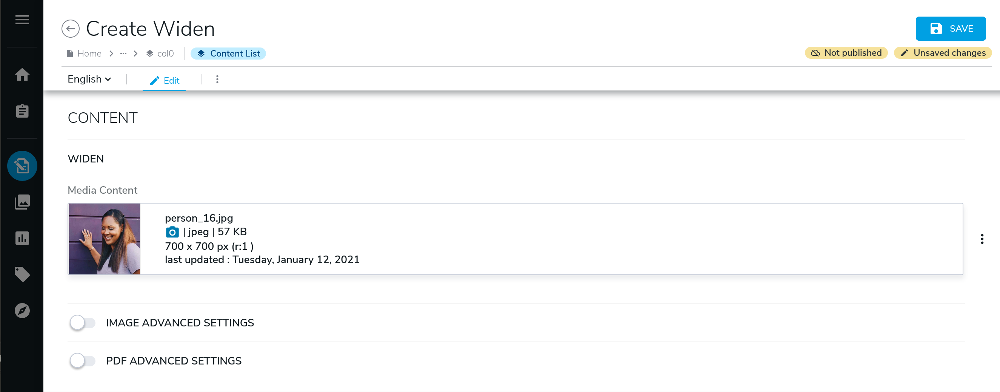
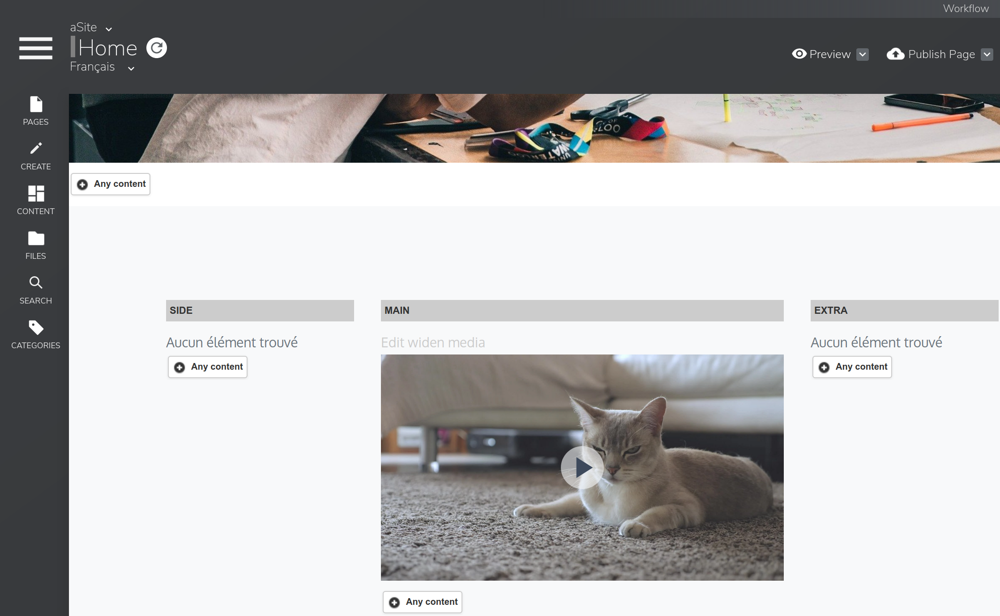

# widen-asset-picker

This module contains the implementation of the Widen Content Picker for Jahia v7.3.x.

With this modules a contributor can easily add a widen media content to a jahia page.


- [Module content](#module-content)
- [Quick Start](#quick-start)
- [Module details](#module-details)
    - [Data flow](#data-flow)
    - [Widen Content in jContent](#widen-content-in-jcontent)
    - [Widen Picker](#widen-picker)
    - [Widen Provider](#widen-provider)
- [Discussion around content picker in jContent v7](./doc/extra.md)


## Module content

This module contains :
1. The definition of a `Widen Reference` content ([definition.cnd](./src/main/resources/META-INF/definitions.cnd)).
1. A React application named `Widen Picker` ([index.js](./src/REACT/src/index.js)). This application is a custom jContent picker and is used to pick a widen asset .
1. A *light* implementation of an External Data Provide (EDP) named `Widen Provider` ([WidenDataSource.java](./src/main/java/org/jahia/se/modules/widenprovider/WidenDataSource.java)).

Not covered by this module :
1. Ckeditor media piker

## Quick Start
### Prerequisites
Before to deploy the module some adjustment must be done in the jahia.properties file (./digital-factory-config/jahia/jahia.properties):
1. Jahia `maxNameSize` must be at least 64 to save widen asset id as system-name.

    uncomment line 260 and change value 32 to 64
    ```
    (-) #jahia.jcr.maxNameSize = 32
    (+) jahia.jcr.maxNameSize = 64
   ```
1. Add your widen configuration to the end of file :
    ```
    ####
    # Widen Config
    ####
    jahia.widen.api.protocol = <http protocol>
    jahia.widen.api.endPoint = <widen api endpoint>
    jahia.widen.api.site = <your widen site name>
    jahia.widen.api.token = <your widen api token>
    jahia.widen.api.version = <api version>
    jahia.widen.edp.mountPoint = <jContent mount point>
    ```
    For example :
    ```
    ####
    # Widen Config
    ####
    jahia.widen.api.protocol = https
    jahia.widen.api.endPoint = api.widencollective.com
    jahia.widen.api.site = acme
    jahia.widen.api.token = ba2d0a71907a17sff9eb9dc1fc91fd3a
    jahia.widen.api.version = v2
    jahia.widen.edp.mountPoint = /sites/systemsite/contents/widen
    ```
### Deploy the module
The module can be installed in 2 ways, from the source or from the store (available soon)
#### From the source
1. Clone this repository or download the zip archive.
1. Go to root of the repository
1. Run the command line `mvn clean install`. This create a jar file in the `target` repository
1. From jContent Goto `Administration` mode
1. Expand `System components` entry and click `Modules`
1. From the right panel click `SELECT MODULE`, and select the jar file created in step 3
1. Finaly click `UPLOAD` 

    

#### From the store
Available soon.

#### Check install
If the module is properly deployed :
1. You should see the `WidenProvider` key in the list of External provider.

    

1. You should be able to create a new `Widen Reference` content.

    

## Module details

To pick a widen asset (video, image, pdf...) from a Widen Cloud intance, Jahia needs 2 mains implemention :
1. A light External Data Provider (EDP), named `Widen Provider`, used to map a Widen asset return as JSON by the widen API into a Jahia node
1. A React application, named `Widen Picker`, used as content picker into Jahia. 
This picker is a user interface (UI) from which jahia contributor can query a Widen server to find and 
select the media asset he wants to use in website.

### Data flow


1. User creates a new `Widen` content (aka as `Widen Reference`, cf. [Module content](#module-content) ).

    
    <!-- .element style="max-width:350px;" -->

    Then jContent displays a contributor form with a field Media Content.

    

1. When user click the field *Media Content* in the form above, the React application `Widen Picker` is launch in iframe. 
    By default, lazyload is false and the application executes an AJAX call to the widen API endpoint to populate the picker -
    [more details here](#widen-picker).
    
    *The picker uses the Widen API : [Assets - List by search query](https://widenv2.docs.apiary.io/#reference/assets/assets/list-by-search-query)*.

1. The widen endpoint return a JSON file uses by the app to display the search contents. Now the user can refine the search or select a widen asset.

    

1. When the user save its choice from the picker, a content path is returned to jContent. This path is build with the value of `jahia.widen.edp.mountPoint`
    and the `id` of the widen asset.
    
    **Note :** jContent checks if this path refers to a jahia node. For that, the path is mapped to a jahia node 
    through the `Widen Provider`.
    
1. If the asset picked is not in the jContent cache, the provider call the widen API endpoint to get all the relevant properties about the asset picked - [more details here](#widen-provider).
        
    *The provider use the Widen API : [Assets - Retrieve by id](https://widenv2.docs.apiary.io/#reference/assets/assets/retrieve-by-id)*.
    
1. The JSON response returned by the API is mapped to a jahia node and cached into an ehcache instance named `cacheWiden`.
    By default, This cache is configured to keep the content 8h maximum and to drop the content if it is idle more than 1 hour. 
    
1. If the path provided in step 4 is correct, the provider return a jahia reference node and the contributor can save its `Widen Reference`
    content.
    
    
    
1. The content can be used by a jContent Page. This module provides jContent views for different type of widen asset (image, video...).

1. The jContent views use the widen CDN URL (aka as embeds.templated.url property) to get and display the content in webpage.
the use of a Widen CDN guarantees good loading performance as well as the proper functioning of widen statistics.

    
   
### Widen content in jContent
jContent v7 restrict the usage of a picker to a JCR node only. Thus, to be able to pick an external widen content,
an equivalent of this widen content is required as a node in jContent.
A node is also usefull to create a dedicated rendering thought a set of views.


#### Architecture overview
The node type architecture implemented in this module is design to be easily extended
by a customer or its integrator.
Indeed, a customer can create in Widen its own metadata and content definition. So, this modules cannot cover
all the possible case. But, new multimedia node types can be easily created.

**Note :** Node types and mixin definitions, discussed later in this section, are written in the file [definition.cnd](./src/main/resources/META-INF/definitions.cnd).

The module provides multiple mixins (explained later) and 5 node types :
1. `wdennt:widenReference`
1. `wdennt:image`
1. `wdennt:video`
1. `wdennt:pdf`
1. `wdennt:document`


From this 5 node types only `wdennt:widenReference` is accessible thought the creation menu.
 
#### wdennt:widenReference
This node type is the only accessible thought the creation menu. In other words,
to add a widen asset into a page, a contributor must create new `wdennt:widenReference` alias *Widen* in the UI.


<!-- .element style="max-width:350px;" -->

##### Definition
This node type is defined like this :
```
[wdennt:widenReference] > jnt:content,jmix:nodeReference, jmix:multimediaContent
 - j:node (weakreference, picker[type='custom',config='widenPicker']) < 'wdenmix:widenAsset'
```

`wdennt:widenReference` is extended by 3 jContent mixins :
1. `jnt:content` : the node type is a content node type
1. `jmix:multimediaContent` : the node type will appear in the *Content:Multimedia* menu entry (see image above)
1. `jmix:nodeReference` : the node is like a *wrapper* used to reference a subset of mutlimedia nodes.
    this mixin provide a default attribute `j:node` uses to store the path of the node in reference. 

The property `j:node` is overwritten to use a custom picker named [widenPicker](#widen-picker)
and restrict the allowed node type to be picked to `wdenmix:widenAsset`.

###### Mixin
####### wdenmix:widenAsset
TODO

##### Views


#### wdennt:image
##### Definition


###### Mixins
Mixins are used to mapp the properties of the JSON returned by the Widen API 
Widen API JSON
```
{}
```

Node definition
```
[wdenmix:fileProperties] mixin
 - wden:format (string)
 - wden:type (string)
 - wden:sizeKB (long)
```


##### Views

#### wdennt:video
##### Definition
##### Views

#### wdennt:pdf
##### Definition
##### Views

#### wdennt:document
##### Definition
##### Views


#### How to extend? example of the audio content type

Thus, if in your Widen Server you create a new media content type like *audio*.
To be able to pick it and store a specific set of metadata related to this type into jContent,
you need a specific node type definition. Also, you will create something like `wdennt:audio`.

To be able to pick this node type from the picker you just need to extend your `wdennt:audio`
node type with the mixin `wdenmix:widenAsset`. Like this, you don't need to touch the definition
of `wdennt:widenReference`)

At this stage, the audio node type definition should looks like :
```
[wdennt:audio] > jnt:content, wdenmix:widenAsset
```

**Note :** you must update the mapping part of the [Widen Provider](#widen-provider)
to have your `wdennt:audio` fully usable in jContent.

#### Usage
This wrapper is required to use the referenced node in a particular "context",
for example to apply a specific view or to fill a set of specific options. 

TODO schema view et params


##### image, video...
Based on the JSON property filetype returned by the API jContent create the appropriate node type (cf. [Widen Provider](#widen-provider))
why ? -> view and specific properties

Pas de table car pas de code bloc...


#### Views
    
### Widen Picker
WORK IN PROGRESS

In order to get all the relevant information the app use the `expand` query parameters with the value `embeds,thumbnails,file_properties`
    (cf. [code](./src/REACT/src/misc/data.js)) 
    
### Widen Provider
WORK IN PROGRESS
Query API
(cf. [queryWiden](./src/main/java/org/jahia/se/modules/widenprovider/WidenDataSource.java)).

Cache
(cf. [start](./src/main/java/org/jahia/se/modules/widenprovider/WidenDataSource.java)).

```
CACHE_NAME = "cacheWiden";
TIME_TO_LIVE_SECONDS = 28800;
TIME_TO_IDLE_SECONDS = 3600;
```

In Jahia EDP can is used to map external asset to jahia node (e.i. tmdb ->linkto),
get multilevel -> create a tree to browse for content explorer,
search from lucene index/augmented search
add additionnal content to external node....
But in our case we don't need all of this features but we only want to picker asset one by one.
So :
1. no need to create a folder with chidren inside
1. no need to implement the search part as we will have a customer picker using directle the widen search api
1. no need to add more content to our asset

Based on these requirements we don't need to implement all the EDP methods and we can qualify our
EDP as Light EDP.

#### Architecture
1. spring/widen-picker.xml
1. org.jahia.se.modules.widenprovider.WidenDataSource -> to enhance use jackson to map json to object
link to edp doc, add tools cache link too
1. config file jahia.properties -> to enhance use .cfg and OSGI


