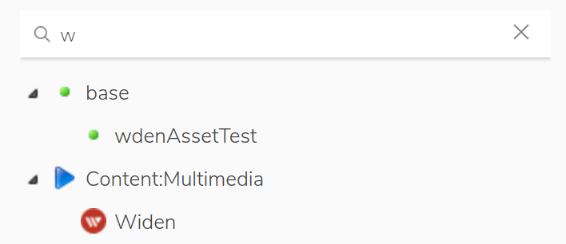
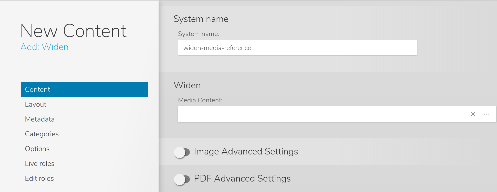

# widen-asset-picker

This module contains the implementation of the Widen Content Picker for Jahia v7.3.x

To pick a widen asset (video, image, pdf...) from a Widen Cloud intance Jahia needs 2 mains implemention :
1. A light External Data Provider (EDP), named `Widen Provider`, used to map a Widen asset return as JSON by the widen API into a Jahia node
1. A React application, named `Widen Picker`, used as content picker into Jahia. 
This picker is a user interface (UI) from which jahia contributor can query a Widen server to find and 
select the media asset he wants to use in website.

##Data flow

1. User creates a new `Widen` content (aka as `Widen Reference`).
    Then jContent displays a contributor form with a field Media Content.
    
        Note : the Widen Reference content is defined in this module.
    
    
    
    

1. The React application `Widen Picker` is launch in iframe and execute an AJAX call to the `Assets : List by search query` Widen API 

##EDP
In Jahia EDP can is used to map external asset to jahia node (e.i. tmdb ->linkto),
get multilevel -> create a tree to browse for content explorer,
search from lucene index/augmented search
add additionnal content to external node....
But in our case we don't need all of this features but we only want to picker asset one by one.
So :
1. no need to create a folder with chidren inside
1. no need to implement the search part as we will have a customer picker using directle the widen search api
1. no need to add more content to our asset

Based on these requirements we don't need to implement all the EDP methods and we can qualify our
EDP as Light EDP.

###Architecture
1. spring/widen-picker.xml
1. org.jahia.se.modules.widenprovider.WidenDataSource -> to enhance use jackson to map json to object
link to edp doc, add tools cache link too
1. config file jahia.properties -> to enhance use .cfg and OSGI

##React Content Picker

###Architecture