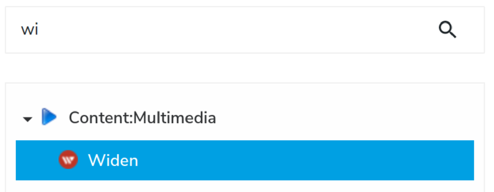

# widen-asset-picker

This module contains the implementation of the Widen Content Picker for Jahia v8.0.1.x

With this module, a contributor can easily add a Widen media asset to a Jahia page.


- [Module content](#module-content)
- [Quick Start](#quick-start)
- [Module details](#module-details)
    - [Data flow](#data-flow)
    - [Widen assets in jContent](#widen-assets-in-jcontent)
    - [Widen Picker](#widen-picker)
    - [Widen Provider](#widen-provider)
    - [How to handle a new media content created in Widen - example of the audio content type](#how-to-handle-a-new-media-asset-created-in-widen---example-of-the-audio-content-type)


## Module content

This module contains:
* The definition of a `Widen Reference` content ([definition.cnd][definition.cnd]).
* A React application named `Widen Picker` ([DamWidenPickerCmp.jsx][react:index.js]).
    This application is a custom jContent picker and is used to pick a Widen asset.
* A *light* implementation of an External Data Provider (EDP) named
    `Widen Provider` ([WidenDataSource.java]).

Not covered in this module:
* CKEditor widen media picker

## Quick Start
### Prerequisites
Before deploying the module, you must make the following changes to the jahia.properties.
* The size of the **System name** `jahia.jcr.maxNameSize` must be greater than the default 32 characters to allow you to save a Widen *asset id* in it.

#### jahia.properties On Premise 
The file to update is located in *digital-factory-config/jahia/jahia.properties* :
    
uncomment line 260 and change value 32 to 64
```
(-) #jahia.jcr.maxNameSize = 32
(+) jahia.jcr.maxNameSize = 64
```  
> You must restart jContent to have these properties available in your environment.

#### jahia.properties On Cloud
From the admin page select your environment in the left panel. Then, click **Configuration** in the main panel.
Expand the **Jahia Configuration** entry and search for *max name*
Click hte Jackrabbit max name size entry, update the value, save you configuration and restart.

![][100]

### Deploy the module
The module can be installed in 2 ways, from the source or from the store (available soon).
#### From the source
1. Clone or download the zip archive of the latest release.
2. If you already know your Widen configuration (api key, site, host) you can update the default
configuration about Widen. Update Properties starting with `mount.wden_` in the file 
[mount-widen.cfg][mount.cfg]. 
1. Go to the root of the repository.
1. Run the command `mvn clean install`. This create a jar file in the *target* repository.
    > you must have a **java sdk** and **maven** installed
1. In jContent, go to `Administration` panel.
1. In the `Server` section expand the `Modules and Extensions` entry and click `Modules`.
1. From the right panel, click `SELECT MODULE` and select the jar file in the *target* repository.
1. Finaly click `UPLOAD`.

    ![][030]

#### From the store
Available soon.

#### Check install
If the module is properly deployed:
1. You should see the `dam-widen` in the list of Mount points

    ![][032]

    This mount point is used by an External provider. 
    
    ![][031]
    
2. You should be able to create a new `Widen Reference` content.

    

### Post Install (optional)
If you didn't update the Widen default configuration (see item 2 of this [section](#from-the-source)),
you have to configure the module with your Widen API access information. This configuration doesn't require
a server restart. To set up your Widen API access got to the jahia tools
(*https://\<jahia host\>/tools*). From the tools UI, click `OSGI console` in the **Administration and Guidance**
fieldset.

![][0070]

In the top menu expand the entry **OSGI** and click **Configuration**

![][0072]

Look for `org.jahia.modules.external.mount.xxxxxxxx-xxx` and click. If you have more than one entry like this
be sure to select the right, the filename must contain **org.jahia.modules.external.mount-widen.cfg**.

Finally, update Properties starting with `mount.wden_` and save your change.

![][0071]
## Module details

To pick a widen asset (for example a video, image, or PDF) from a Widen Cloud instance, you need to implement:
1. A *light* External Data Provider (EDP), named `Widen Provider`,
    that maps the JSON returned by the widen API and represents the Widen asset into a Jahia node.
2. A React application named `Widen Picker`, and used as a `selectorType` in jContent. 
    This picker is a user interface (UI) from which a jContent user can query a Widen server to find and 
    select the media asset they want to use on the website.

### Data flow

![][010]

The data flow is composed by 10 actions of which 4 are optional and depend on the cache. 

1. The user creates a new `Widen` content (aka a `Widen Reference`).

    
    
    Then, jContent displays a user form with a **Media Content** field. The React application `Widen Picker`
    used as a `selectorType` is launched and displays a placeholder.
    
    >A selectorType has 2 main component :
    one used to present the selected content, or a placeholder if no content is selected,
    and one used to pick a content.

    ![][002]

2. When user clicks the **Media Content** field, the picker component of the React application is launched into a modal. 
    By default, the lazy-loading is set to false, and the application executes an AJAX call to the widen API endpoint to populate the picker. For
    more details see [the Widen Picker][picker.md] section.
    
    > The picker uses the Widen API: [Assets - List by search query][widenAPI:AssetByQuery].

3. The Widen endpoint returns a JSON file uses by the app to render the search contents. The user can refine the search or select a Widen asset.

    ![][0041]

4. When the user saves their choice from the picker, a content path is created. This path is built with the value of
    the properties `mount.j_path`, `mount.j_nodename` and the `id` of the Widen asset.
    
    > jContent cannot use this path directly as it expect to recieve a node id. 
    To get this id the picker executes a GraphQL call to create the node and get its id.
    During this call, the path is resolved and mapped to a Jahia node 
    with the help of the `Widen Provider`.
    
5. If the selected asset is not in the jContent cache, the provider calls the Widen API endpoint to get the relevant properties
about the selected asset. For more details, see [the Widen Provider][provider.md] section.
        
    > The provider uses the Widen API: [Assets - Retrieve by id][widenAPI:AssetById].

6. The JSON response returned by the API is mapped to a Jahia node and cached into an Ehcache instance named `cacheWiden`.
    By default, the cache is configured to keep the content for a maximum of 8 hours and to drop the content if it is idle for more than 1 hour. 
    
7. If the path provided in step 4 is correct, the provider return a Jahia reference node, and the user can save their `Widen Reference`
    content.
    
    ![][005]
    
8. The content can be used by a jContent Page. This module provides jContent views for different type of widen assets (for example images and videos).

9. The jContent views use the widen CDN URL (aka *embeds.templated.url* property) to get and render the content in a webpage.
The Widen CDN improves performance when assets load and allows Widen to collect statistics.

10. The Widen asset is rendered into the website.

    ![][0061]
    > you can select the view of the content in reference. In the image above the view **bubble** is selected
### Widen assets in jContent
[Read this dedicated page][contentDefinition.md]
 
### Widen Picker
[Read this dedicated page][picker.md]

### Widen Provider
[Read this dedicated page][provider.md]

### How to handle a new media asset created in Widen - example of the audio content type
[Read this dedicated page][enhance.md]


[030]: ./doc/images/030_install.png
[031]: ./doc/images/031_install_completed.png
[032]: ./doc/images/032_install_completed.png
[010]: ./doc/images/010_archi.png
<!--[001]: ./doc/images/001_menu-select.png
[0011]: ./doc/images/0011_menuSelect2.png-->
[002]: ./doc/images/002_widenReference.png
[0041]: ./doc/images/004_widenPickerSelected.png
[005]: ./doc/images/005_widenReferenceSelected.png
[0061]: ./doc/images/0061_widenAssetInSite.png
[0070]: ./doc/images/0070_OSGIConfig.png
[0071]: ./doc/images/0071_OSGIConfig.png
[0072]: ./doc/images/0072_OSGIConfig.png
[100]: ./doc/images/100_prequisiteCloud.png

[contentDefinition.md]: ./doc/en/contentDefinition.md
[picker.md]: ./doc/en/picker.md
[provider.md]: ./doc/en/provider.md
[enhance.md]: ./doc/en/enhance.md

[mount.cfg]: ./content-editor-extensions/src/main/resources/META-INF/configurations/org.jahia.modules.external.mount-widen.cfg
[definition.cnd]: ./content-editor-extensions/src/main/resources/META-INF/definitions.cnd
[react:index.js]: ./content-editor-extensions/src/javascript/ContentEditorExtensions/SelectorTypes/DamWidenPicker/DamWidenPickerCmp.jsx
[WidenDataSource.java]: ./content-editor-extensions/src/main/java/org/jahia/se/modules/edp/dam/widen/WidenDataSource.java

[widenAPI:AssetByQuery]: https://widenv2.docs.apiary.io/#reference/assets/assets/list-by-search-query
[widenAPI:AssetById]: https://widenv2.docs.apiary.io/#reference/assets/assets/retrieve-by-id


