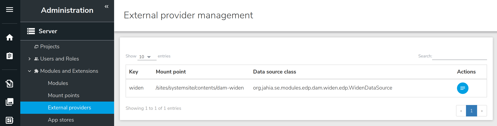

# widen-asset-picker

This module contains the implementation of the Widen Content Picker for Jahia v7.3.x.

With this modules a contributor can easily add a widen media content to a jahia page.


- [Module content](#module-content)
- [Quick Start](#quick-start)
- [Module details](#module-details)
    - [Data flow](#data-flow)
    - [Widen Provider](#edp)
    - [Widen Picker](#react-content-picker)
- [Discussion around content picker in jContent v7](./doc/extra.md)


## Module content

This module contains :
1. The definition of a `Widen Reference` content ([definition.cnd](./src/main/resources/META-INF/definitions.cnd)).
1. A React application named `Widen Picker` ([index.js](./src/REACT/src/index.js)). This application is a custom jContent picker and is used to pick a widen asset .
1. A *light* implementation of an External Data Provide (EDP) named `Widen Provider` ([WidenDataSource.java](./src/main/java/org/jahia/se/modules/widenprovider/WidenDataSource.java)).

Not covered by this module :
1. Ckeditor media piker

## Quick Start
### Prerequisites
Before to deploy the module some adjustment must be done in the jahia.properties file (./digital-factory-config/jahia/jahia.properties):
1. Jahia `maxNameSize` must be at least 64 to save widen asset id as system-name.

    uncomment line 260 and change value 32 to 64
    ```
    (-) #jahia.jcr.maxNameSize = 32
    (+) jahia.jcr.maxNameSize = 64
   ```
1. Add your widen configuration to the end of file :
    ```
    ####
    # Widen Config
    ####
    jahia.widen.api.protocol = <http protocol>
    jahia.widen.api.endPoint = <widen api endpoint>
    jahia.widen.api.site = <your widen site name>
    jahia.widen.api.token = <your widen api token>
    jahia.widen.api.version = <api version>
    jahia.widen.edp.mountPoint = <jContent mount point>
    ```
    For example :
    ```
    ####
    # Widen Config
    ####
    jahia.widen.api.protocol = https
    jahia.widen.api.endPoint = api.widencollective.com
    jahia.widen.api.site = acme
    jahia.widen.api.token = ba2d0a71907a17sff9eb9dc1fc91fd3a
    jahia.widen.api.version = v2
    jahia.widen.edp.mountPoint = /sites/systemsite/contents/widen
    ```
### Deploy the module
The module can be installed in 2 ways, from the source or from the store (available soon)
#### From the source
1. Clone this repository or download the zip archive.
1. Go to root of the repository
1. Run the command line `mvn clean install`. This create a jar file in the `target` repository
1. From jContent Goto `Administration` mode
1. Expand `System components` entry and click `Modules`
1. From the right panel click `SELECT MODULE`, and select the jar file created in step 3
1. Finaly click `UPLOAD` 

    

#### From the store
Available soon.

#### Check install
If the module is properly deployed :
1. You should see the `WidenProvider` key in the list of External provider.

    

1. You should be able to create a new `Widen Reference` content.

    

## Module details

To pick a widen asset (video, image, pdf...) from a Widen Cloud intance Jahia needs 2 mains implemention :
1. A light External Data Provider (EDP), named `Widen Provider`, used to map a Widen asset return as JSON by the widen API into a Jahia node
1. A React application, named `Widen Picker`, used as content picker into Jahia. 
This picker is a user interface (UI) from which jahia contributor can query a Widen server to find and 
select the media asset he wants to use in website.

### Data flow


1. User creates a new `Widen` content (aka as `Widen Reference`, cf. [Module content](#module-content) ).

    

    Then jContent displays a contributor form with a field Media Content.

    

1. When user click the field *Media Content* in the form above, the React application `Widen Picker` is launch in iframe. 
    By default, lazyload is false and the application execute an AJAX call to the widen API endpoint to populate the picker.
    
    The app use the Widen API : [Assets - List by search query](https://widenv2.docs.apiary.io/#reference/assets/assets/list-by-search-query).
    
    In order to get all the relevant information the app use the `expand` query parameters with the value `embeds,thumbnails,file_properties`
    (cf. [code](./src/REACT/src/misc/data.js)) 
1. The widen endpoint return a JSON file uses by the app to display the search contents. Now the user can refine the search or select a widen asset.
1. When the user save its choice from the picker, a content path is returned to jContent. This path is build with the value of `jahia.widen.edp.mountPoint`
    and the id of the widen asset. Then the system checks if this path refers to a jahia node. This path is mapped to a jahia node 
    through the `Widen Provider`.
1. The provider 
### EDP
In Jahia EDP can is used to map external asset to jahia node (e.i. tmdb ->linkto),
get multilevel -> create a tree to browse for content explorer,
search from lucene index/augmented search
add additionnal content to external node....
But in our case we don't need all of this features but we only want to picker asset one by one.
So :
1. no need to create a folder with chidren inside
1. no need to implement the search part as we will have a customer picker using directle the widen search api
1. no need to add more content to our asset

Based on these requirements we don't need to implement all the EDP methods and we can qualify our
EDP as Light EDP.

#### Architecture
1. spring/widen-picker.xml
1. org.jahia.se.modules.widenprovider.WidenDataSource -> to enhance use jackson to map json to object
link to edp doc, add tools cache link too
1. config file jahia.properties -> to enhance use .cfg and OSGI


### React Content Picker

#### Architecture