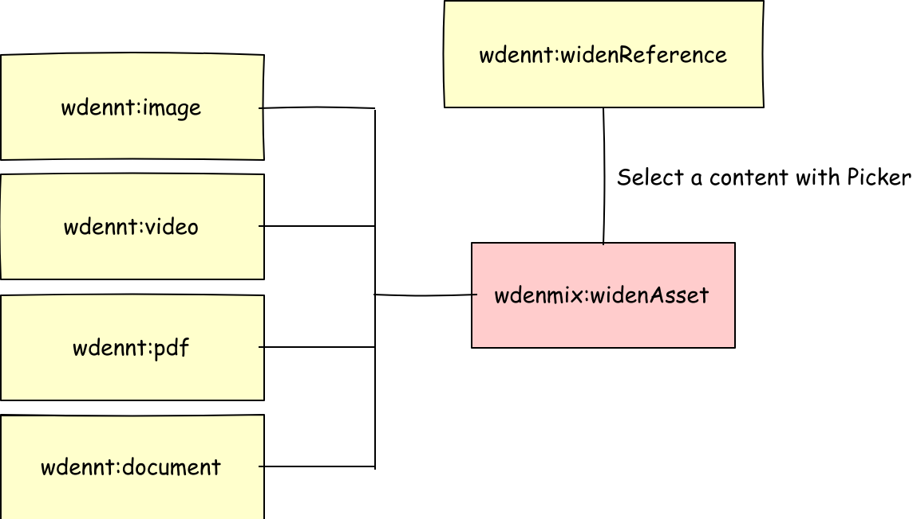
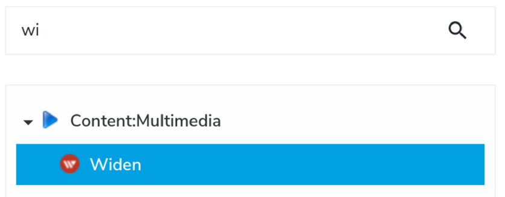

\[[<< back][README.md]\]
# Widen asset in jContent
For each external Widen asset that a user picks,
jContent must create a JCR node equivalent of this Widen asset.
A node is also useful for creating a dedicated rendering through a set of views.

- [Architecture overview](#architecture-overview)
- [wdennt:widenReference](#wdenntwidenreference)
    - [Definition](#definition)
        - [wdenmix:widenAsset](#wdenmixwidenasset)
        - [wdenmix:embed](#wdenmixembed)
        - [wdenmix:fileProperties](#wdenmixfileproperties)
    - [Views](#views)
        - [wdenmix:imageMediaSettings](#wdenmiximagemediasettings)
        - [wdenmix:pdfMediaSettings](#wdenmixpdfmediasettings)
- [wdennt:image](#wdenntimage)
    - [Definition](#definition-1)
        - [wdenmix:imageFileProperties](#wdenmiximagefileproperties)
    - [Views](#views-1)
- [wdennt:video](#wdenntvideo)
    - [Definition](#definition-2)
        - [wdenmix:videoFileProperties](#wdenmixvideofileproperties)
        - [wdenmix:embedVideo](#wdenmixembedvideo)
    - [Views](#views-2)
- [wdennt:pdf](#wdenntpdf)
    - [Definition](#definition-3)
        - [wdenmix:pdfFileProperties](#wdenmixpdffileproperties)
        - [wdenmix:embedPdf](#wdenmixembedpdf)
    - [Views](#views-3)
- [wdennt:document](#wdenntdocument)
    - [Definition](#definition-4)
    - [Views](#views-4)
- [wdenmix:mediaReference](#wdenmixmediareference)

## Architecture overview
The node type architecture, implemented in this module, is designed to be easily extended
by a customer or their integrator.
As a customer can create their own metadata type in Widen, this module does not cover
all possible cases. But, new multimedia node types can be easily created.

The module provides multiple mixins (explained later) and the following node types :
* `wdennt:widenReference`
* `wdennt:image`
* `wdennt:video`
* `wdennt:pdf`
* `wdennt:document`

The hierarchy between the mixins and node types is presented in the schema below:



From the node types, only `wdennt:widenReference` is accessible through the *create menu*.
 
> Node types and mixin definitions, discussed later in this section, are written in the 
[definition.cnd] file.
> 
## wdennt:widenReference
This node type is the only one accessible through the *create menu*. In other words,
to add a widen asset into a page, a contributor must create a new `wdennt:widenReference` alias **Widen** in the UI.



### Definition
This node type is defined like this:
```cnd
[wdennt:widenReference] > jnt:content,jmix:nodeReference, jmix:multimediaContent
 - j:node (weakreference) < 'wdenmix:widenAsset'
```

`wdennt:widenReference` extends 3 supertypes:
1. `jnt:content` meaning the node type is a content node type.
1. `jmix:multimediaContent` meaning the node type appears in the **Content:Multimedia** menu entry (see image above)
1. `jmix:nodeReference` meaning the node is like a *wrapper* used to reference a subset of mutlimedia nodes.
    This mixin provides a default attribute `j:node` used to store the path of the referenced node.

>In this definition, the property `j:node` is overwritten. Indeed, we want to restrict the allowed
> node type to be picked to node types that extend `wdenmix:widenAsset`, and use a custom picker
> named [widenPicker][picker.md]. The picker is configured in the file [wdennt_widenReference.json]

#### Mixins
#### wdenmix:widenAsset
The mixin `wdenmix:widenAsset` defines a set of *jcr* properties used to map the properties common to all Widen assets and returned by 
the JSON API. As these properties are common to all Widen assets, each jContent node type must extend this mixin.

> The mapping process is covered in [Widen Provider][provider.md] section.

The Widen API allows clients to expand the JSON response with the *expand* query parameter
(see the Widen documentation [Assets - List by search query][widenAPI:AssetByQuery] or [Assets - Retrieve by id][widenAPI:AssetById] ).

In our case, we expand the JSON response with **embeds**, **thumbnails**, and **file_properties**. The JSON response returned by the API looks
like this: 

```json
{
    "id": "1eca8de8-f57b-4974-96e4-c7d24cb7a82d",
    "external_id": "jzrdv8kipa",
    "filename": "Image dog + cat in snow.jpg",
    "created_date": "2020-11-18T14:31:10Z",
    "last_update_date": "2020-11-18T16:17:58Z",
    "file_upload_date": "2020-11-18T14:31:10Z",
    "deleted_date": null,
    "released_and_not_expired": true,
    "asset_properties": null,
    "file_properties": {},
    "metadata": null,
    "metadata_info": null,
    "security": null,
    "status": null,
    "thumbnails": {},
    "embeds": {},
    "expanded": {},
    "_links": {}
}
```
The common properties to map are:
`id`, `external_id`, `filename`, `created_date`, `last_update_date`, `deleted_date` and `thumbnails`.

The definition of the mixin looks like this:
```cnd
[wdenmix:widenAsset] > jmix:structuredContent, jmix:tagged, jmix:keywords, mix:title mixin
 - wden:id (string) fulltextsearchable=no
 - wden:externalId (string) fulltextsearchable=no
 - wden:filename (string) fulltextsearchable=no
 - wden:createdDate (string) fulltextsearchable=no
 - wden:updatedDate (string) fulltextsearchable=no
 - wden:deletedDate (string) fulltextsearchable=no
 - wden:thumbnail (string) fulltextsearchable=no
```

As discussed, the JSON response is expanded with **embeds**, **thumbnails**, and **file_properties**. Therefore, the JSON response contains
2 JSON objects: `embeds` and `file_properties`. The properties of these objects depend on the asset type returned. They also contain
common properties.
Therefore, the module contains 2 other mixins, `wdenmix:embed` and `wdenmix:fileProperties`, to map these common properties.

#### wdenmix:embed
The mixin `wdenmix:embed` maps the common properties available in the `embeds` object returned by the Widen API.

```json
{
    "id": "1eca8de8-f57b-4974-96e4-c7d24cb7a82d",
    
    "embeds": {
        "(àX()": {},
        "640px-landscape": {},
        "640px-portrait": {},
        "Facebook-cover": {},
        "PostFacebook/Instagram": {},
        "Website": {},
        "original": {},
        
        "templated": {
            "url": "https://embed.widencdn.net/img/<acme>/jzrdv8kipa/{size}px@{scale}x/Image-dog--cat-in-snow.jpg?q={quality}&x.template=y",
            "html": null,
            "share": null,
            "apps": []
        }
    },
    
}
```
The module only maps the `embeds.templated.url` property. The mixin definition looks like this:
```cnd
[wdenmix:embed] mixin
 - wden:templatedUrl (string) fulltextsearchable=no
```

#### wdenmix:fileProperties
The mixin `wdenmix:fileProperties` maps the common properties available in the `file_properties`
object returned by the Widen API.

```json
{
    "id": "1eca8de8-f57b-4974-96e4-c7d24cb7a82d",
    
    "file_properties": {
        "format": "JPEG",
        "format_type": "image",
        "size_in_kbytes": 2255,
        "image_properties": {},
        "video_properties": null
    },
    
}
```
In the case above, the asset is an image, so `file_properties.image_properties` is an object and `file_properties.video_properties` is null.
These properties are respectively populated only if the asset is an image or a video.

The common properties are `format`, `format_type`, and `size_in_kbytes`.
 
The mixin definition looks like this:

```cnd
[wdenmix:fileProperties] mixin
 - wden:format (string)
 - wden:type (string)
 - wden:sizeKB (long)
```

### Views
The module provides a [default view][widenReference.jsp] 
for the `wdennt:widenReference` node type. The purpose of this view is to call the appropriate view for the content in reference.

Template parameters are defined to provide a set of image widths when the content in reference is an image or
the PDF viewer height when the content in reference is a PDF.

These parameters are contributed from the UI.
For example, enable **Image Advanced Settings** in case of image or **PDF Advanced Settings** in case of PDF.

![005]

These parameters are defined by the `wdenmix:imageMediaSettings` and `wdenmix:pdfMediaSettings` mixins.

#### wdenmix:imageMediaSettings
```cnd
[wdenmix:imageMediaSettings] mixin
 extends = wdennt:widenReference
 itemtype = content
 - wden:defaultImageSize (long)
 - wden:imageSizes (long) multiple
```
#### wdenmix:pdfMediaSettings
```cnd
[wdenmix:pdfMediaSettings] mixin
 extends = wdennt:widenReference
 itemtype = content
 - wden:pdfMinHeight (long)
```

If needed, you can create your own mixin to extend `wdennt:widenReference`
to enable contributors to fine tune specific content.

## wdennt:image
This node type maps a Widen asset of type **image** : `file_properties.format_type = 'image'`.
A `wdennt:image` node has a dedicated set of properties and views.


### Definition
The node type is defined like this:
```cnd
[wdennt:image] > jnt:content, wdenmix:widenAsset, wdenmix:imageFileProperties, wdenmix:embed
```

`wdennt:image` extends the following supertypes:
* `jnt:content` meaning the node type is a content node type.
* `wdenmix:widenAsset` meaning the node inherits properties of the mixin ([+](#wdenmixwidenasset)).
* `wdenmix:imageFileProperties` meaning the node inherits properties of the mixin ([+](#wdenmiximagefileproperties)).
* `wdenmix:embed` meaning the node inherits properties of the mixin ([+](#wdenmixembed)).

The node type doesn't have specific property. All properties come from supertypes.

#### Mixin

#### wdenmix:imageFileProperties
The mixin `wdenmix:imageFileProperties` extends the `wdenmix:fileProperties` mixin and inherits its
properties ([+](#wdenmixfileproperties)). The mixin maps the specifics properties of the JSON object `file_properties.image_properties`
returned for an image asset.

For an image, these properties are `width`, `height`, and`aspect_ratio` as shown in the following JSON.

```json
{
    "id": "1eca8de8-f57b-4974-96e4-c7d24cb7a82d",
    
    "file_properties": {
        "format": "JPEG",
        "format_type": "image",
        "size_in_kbytes": 2255,
        "image_properties": {
            "width": 4288.0,
            "height": 2848.0,
            "aspect_ratio": 1.505617977528
        },
        "video_properties": null
    },
    
}
```

To store these properties, the mixin is defined like this:
```cnd
[wdenmix:imageFileProperties] > wdenmix:fileProperties mixin
 - wden:width (double)
 - wden:height (double)
 - wden:aspectRatio (double)
```

### Views
The module provides 2 views:
1. A [default view][image.jsp] which return the HTML tag 

    ```jsp
    " 
         srcset="<widen cdn image urls for each selected width>"
         sizes="<prefered image sizes based on element width>"
         class="<css classname to apply>"
         alt="<filename>"
    />
    ``` 
    The *\<widen cdn image url\>* is the value stored in the `wden:templatedUrl` ([+](#wdenmixembed)) property.
    This value contains variables `{size}`, `{scale}`, and `{quality}` resolved by the view.
    This allows contributors (cf. [Image Advanced Settings](#views))
    or template integrators to get the image with the desired size (`defaultWith` : 768).
    
    A srcset can also be created based on *width number* in a list (`widths` : [256, 512, 768, 1024, 1280, 1600, 2000]).
    
    Other variables can be provided to the view to customize the rendering of the tag:
    * `sizes` : default `'(min-width: 600px) 1024px, 512px'`
    * `class` : no default value

1. A hidden view named [getSrc.jsp][image.hidden.getSrc.jsp].
    This view returns the image src and srcset resolved in the same way as with the default view.
    Note that the view doesn't return any HTML tags, only variables :

    ```jsp
    <c:set target="${moduleMap}" property="src" value="${src}" />
    <c:set target="${moduleMap}" property="srcset" value="${srcset}" />
    ```
    which can be used by the caller this way:
    
    ```jsp
    <template:include view="hidden.getSrc">
        <template:param name="widths" value="1024"/>
        <template:param name="defaultWidth" value="1024"/>
    </template:include>
    
    <div class="scaling-image h-100">
        <div class="frame h-100">
            <div class="feature-img-bg h-100" style="background-image: url('${moduleMap.src}');">
            </div>
        </div>
    </div>
    ```
    > To solve the case above, the **best practice** is to create a dedicated **tag library** to resolve the URL.
    *Feel free to contribute*.
    
    
## wdennt:video
This node type maps a Widen asset of type **video**: `file_properties.format_type = 'video'`.
A `wdennt:video` node has a dedicated set of properties and views.


### Definition
This node type is defined like this:
```cnd
[wdennt:video] > jnt:content, wdenmix:widenAsset, wdenmix:videoFileProperties, wdenmix:embedVideo
```

`wdennt:video` extends the following supertypes:
* `jnt:content` meaning the node type is a content node type
* `wdenmix:widenAsset` meaning the node inherits properties of the mixin ([+](#wdenmixwidenasset))
* `wdenmix:videoFileProperties` meaning the node inherits properties of the mixin ([+](#wdenmixvideofileproperties))
* `wdenmix:embedVideo` meaning the node inherits properties of the mixin ([+](#wdenmixembedvideo))

The node type doesn't have specific property. All properties come from supertypes.

#### Mixins

#### wdenmix:videoFileProperties
The mixin `wdenmix:videoFileProperties` extends the mixin `wdenmix:imageFileProperties` and inherits its
properties ([+](#wdenmiximagefileproperties)).
The mixin maps the specifics properties of the JSON object `file_properties.video_properties` returned for a video asset.

For a video, these properties are `width`, `height`, `aspect_ratio`, and `duration` as shown in the following JSON.

```json
{
    "id": "2eca8de8-f57b-4974-96e4-c7d24cb7a82f",
    
    "file_properties": {
        "format": "MPEG4",
        "format_type": "video",
        "size_in_kbytes": 11962,
        "image_properties": null,
        "video_properties": {
            "width": 1080.0,
            "height": 1920.0,
            "aspect_ratio": 0.562,
            "duration": 8.88
        }
    },
    
}
```

To store these properties, the mixin is defined like this :
```cnd
[wdenmix:videoFileProperties] > wdenmix:imageFileProperties mixin
 - wden:duration (double)
```
> Remember that `width`, `height` and `aspect_ratio` are inherited from `wdenmix:imageFileProperties`.

#### wdenmix:embedVideo
The mixin `wdenmix:embedVideo` extends the mixin `wdenmix:embed` and inherits its
properties ([+](#wdenmixembed)). 
The mixin maps the specifics properties of the JSON object `embeds` returned for a video asset.

For a video, these properties are:
* `video_player.url`
* `video_stream.url`
* `video_stream.html`
* `video_poster.url`

as shown in the JSON below.
```json
{
    "id": "2eca8de8-f57b-4974-96e4-c7d24cb7a82f",
    
    "embeds": {
        "VideoWithPlayerAndDownload": {},
        "video_player": {
            "url": "https://acme.widen.net/view/video/87tlstii2j/08_Aout.mp4?u=2spbki",
            "html": "<div style=\"position:relative;width:100%;height:0;padding-bottom:56.25%;\"><iframe src=\"https://acme.widen.net/view/video/87tlstii2j/08_Aout?u=2spbki\" webkitallowfullscreen mozallowfullscreen allowfullscreen frameborder=\"0\" allowtransparency=\"true\" scrolling=\"no\" style=\"position:absolute;top:0;left:0;width:100%;height:100%;\" ></iframe></div>",
            "share": "https://acme.widen.net/view/video/87tlstii2j/08_Aout.mp4?u=2spbki&x.share=t",
            "apps": []
        },
        "video_poster": {
            "url": "https://acme.widen.net/content/87tlstii2j/jpeg/08_Aout.jpg?u=2spbki",
            "html": "",
            "share": "https://acme.widen.net/view/thumbnail/87tlstii2j/08_Aout.jpg?t.format=jpeg&u=2spbki&x.share=t",
            "apps": []
        },
        "video_stream": {
            "url": "https://acme.widen.net/content/87tlstii2j/mp4/08_Aout.mp4?quality=hd&u=2spbki",
            "html": "<video controls><source src=\"https://acme.widen.net/content/87tlstii2j/mp4/08_Aout.mp4?quality=hd&u=2spbki\" type=\"video/mp4\"></video>",
            "share": "https://acme.widen.net/view/video/87tlstii2j/08_Aout.mp4?u=2spbki&x.share=t",
            "apps": []
        }
        
    },
    
}
```

To store these properties, the mixin is defined like this:
```cnd
[wdenmix:embedVideo] > wdenmix:embed  mixin
 - wden:videoPlayer (string) fulltextsearchable=no
 - wden:videoStreamURL (string) fulltextsearchable=no
 - wden:videoStreamHTML (string) fulltextsearchable=no
 - wden:videoPoster (string) fulltextsearchable=no
```
> If you need more attribute for **video** assets, you can add them to this definition. Don't forget to update the mapping process 
>(see [Widen Provider][provider.md])

These properties are used by views to display HTML5 video players.

### Views
The module provides the following views :
* a [default view][video.jsp] which returns the Widen video player
    loaded through an iframe. The iframe src is the value stored in the property `wden:videoPlayer`.

* a [VJS video player view][video.player.vjs.jsp] which uses the
    [Video-js player][videojs.com] to play the video. The player is configured with `wden:videoStreamURL` and 
    `wden:videoPoster`.

* a [native HTML5 player view][video.stream.jsp] which returns the value
    of `wden:videoStreamHTML`. The view uses the HTML code returned by the Widen API with a few CSS adjustments.

## wdennt:pdf
This node type maps a Widen asset of type **pdf** : `file_properties.format_type = 'pdf'`.
A `wdennt:pdf` node has a dedicated set of properties and views.

### Definition
This node type is defined like this:
```cnd
[wdennt:pdf] > jnt:content, wdenmix:widenAsset, wdenmix:pdfFileProperties, wdenmix:embedPdf
```

`wdennt:pdf` extends the following supertypes:
* `jnt:content` meaning the node type is a content node type
* `wdenmix:widenAsset` meaning the node inherits properties of the mixin ([+](#wdenmixwidenasset))
* `wdenmix:pdfFileProperties` meaning the node inherits properties of the mixin ([+](#wdenmixpdffileproperties)).
* `wdenmix:embedPdf` meaning the node inherits properties of the mixin ([+](#wdenmixembedpdf))

The node type doesn't have specific property. All properties come from supertypes.

#### Mixin

#### wdenmix:pdfFileProperties
The mixin `wdenmix:pdfFileProperties` extends the mixin `wdenmix:fileProperties` and inherits its
properties ([+](#wdenmixfileproperties)). PDF assets only use properties common to files, so the mixin is defined like this:
```cnd
[wdenmix:pdfFileProperties] > wdenmix:fileProperties mixin
```
> If, in the future, the API returns specific file properties for **pdf** assets, you can add them to this definition.
>Don't forget to update the mapping process (see [Widen Provider][provider.md])

#### wdenmix:embedPdf
The mixin `wdenmix:embedPdf` extends the mixin `wdenmix:embed` and inherits its
properties ([+](#wdenmixembed)).
The mixin maps the specifics properties of the JSON object `embeds` returned for a PDF asset.

For a PDF, these properties are:
* `document_html5_viewer.url`
* `document_viewer.url`
* `document_thumbnail.url`
* `original.url`
* `original.html`

as shown in the JSON below.
```json
{
    "id": "866b23a5-442b-4f31-8cf7-5b27363f35be",
    
    "embeds": {
        "document_html5_viewer": {
            "url": "https://acme.widen.net/view/pdf/utqlxflgpa/acme_overview.pdf?u=2spbki",
            "html": "<iframe src=\"https://acme.widen.net/view/pdf/utqlxflgpa/acme_overview.pdf?u=2spbki\" webkitallowfullscreen mozallowfullscreen allowfullscreen ></iframe>",
            "share": "https://acme.widen.net/view/pdf/utqlxflgpa/acme_overview.pdf?u=2spbki&x.share=t",
            "apps": []
        },
        "document_thumbnail": {
            "url": "https://acme.widen.net/content/utqlxflgpa/jpeg/acme_overview.jpg?u=2spbki",
            "html": "",
            "share": "https://acme.widen.net/view/thumbnail/utqlxflgpa/acme_overview.pdf?t.format=jpeg&u=2spbki&x.share=t",
            "apps": []
        },
        "document_viewer": {
            "url": "https://acme.widen.net/content/utqlxflgpa/pdf/acme_overview.pdf?u=2spbki",
            "html": "<iframe src=\"https://acme.widen.net/content/utqlxflgpa/pdf/acme_overview.pdf?u=2spbki\" webkitallowfullscreen mozallowfullscreen allowfullscreen ></iframe>",
            "share": "https://acme.widen.net/view/pdf/utqlxflgpa/acme_overview.pdf?u=2spbki&x.share=t",
            "apps": []
        },
        "original": {
            "url": "https://acme.widen.net/content/utqlxflgpa/original/acme_overview.pdf?u=2spbki&download=true",
            "html": "<a href=\"https://acme.widen.net/content/utqlxflgpa/original/acme_overview.pdf?u=2spbki&download=true\" target=\"_blank\">acme_overview.pdf</a>",
            "share": "https://acme.widen.net/content/utqlxflgpa/original/acme_overview.pdf?u=2spbki&download=true&x.share=t",
            "apps": []
        },
        
    },
    
}
```

To store these properties, the mixin is defined like this:
```cnd
[wdenmix:embedPdf] > wdenmix:embed  mixin
 - wden:viewerHtml5 (string) fulltextsearchable=no
 - wden:viewer (string) fulltextsearchable=no
 - wden:docThumbnail (string) fulltextsearchable=no
 - wden:docURL (string) fulltextsearchable=no
 - wden:docHTMLLink (string) fulltextsearchable=no
```
> If you need more attribute for **pdf** assets, you can add them to this definition. Don't forget to update the mapping process 
>(see [Widen Provider][provider.md])

These properties are used by views to display pdf node within an HTML5 view or like a link.

### Views
The module provides 3 views :
1. a [default view][pdf.jsp] which returns the Widen PDF viewer
    loaded through an iframe. The iframe src is the value stored in the property `wden:viewer`.
    The minimal height of the viewer can be forced by the user (see [PDF Advanced Settings](#views))
    or the template integrator (`pdfMinHeight` : 512).

1. an [HTML5 viewer][pdf.viewerHTML5.jsp] which uses the
    native pdf viewer loaded through an iframe. The iframe src is the value stored in the 
    property `wden:viewerHtml5`.
    The minimal height of the viewer can be forced by the user (see [PDF Advanced Settings](#views))
    or the template integrator (`pdfMinHeight` : 512).

1. a [link][pdf.link.jsp] which returns the value
    of `wden:docHTMLLink`. The view uses directly the HTML code returned by the Widen API.


## wdennt:document
This node type maps a Widen asset which is **not** image, video or PDF. It is the default
node type. A `wdennt:document` node extends the generic mixins.

### Definition
This node type is defined like this:
```
[wdennt:document] > jnt:content, wdenmix:widenAsset, wdenmix:fileProperties
```

`wdennt:document` extends the following supertypes:
* `jnt:content` meaning the node type is a content node type
* `wdenmix:widenAsset` meaning the node inherits properties of the mixin ([+](#wdenmixwidenasset))
* `wdenmix:fileProperties` meaning the node inherits properties of the mixin ([+](#wdenmixfileproperties))

The node type doesn't have specific property. All properties come from supertypes.

### Views
The module provides a default empty view. *Feel free to customize it*.

## wdenmix:mediaReference
This mixin can be used by tiers modules to add a custom selector, named **Media Source**, to select the source
of the media content to pick. The source could be Widen or jContent.

> This mixin is used in this [project][quiz:cnd] and the widen asset render both with a [jsp view][quiz:jsp.view] and with a
[React component][quiz:react.view].


When the source is selected, the user picks a media (**Media Content**) and store the value of the selected content
in a property named `wden:mediaNode` (weakreference).

Pick a media content from jContent
![100]

Pick a media content from Widen
![101]

\[[< back][README.md]\]

<!--
[040]: ../images/040_nodeArch.png
[0011]: ../images/0011_menuSelect2.png
-->
[005]: ../images/005_widenReferenceSelected.png
[100]:../images/100_MediaReferenceMixin.png
[101]: ../images/101_MediaReferenceMixin.png

[definition.cnd]: ../../src/main/resources/META-INF/definitions.cnd
[widenReference.jsp]: ../../src/main/resources/wdennt_widenReference/html/widenReference.jsp
[image.jsp]: ../../src/main/resources/wdennt_image/html/image.jsp
[image.hidden.getSrc.jsp]: src/main/resources/wdennt_image/html/image.hidden.getSrc.jsp
[video.jsp]: ../../src/main/resources/wdennt_video/html/video.jsp
[video.player.vjs.jsp]: ../../src/main/resources/wdennt_video/html/video.player.vjs.jsp
[video.stream.jsp]: ../../src/main/resources/wdennt_video/html/video.stream.jsp
[pdf.link.jsp]: ../../src/main/resources/wdennt_pdf/html/pdf.link.jsp
[pdf.viewerHTML5.jsp]: ../../src/main/resources/wdennt_pdf/html/pdf.viewerHTML5.jsp
[pdf.jsp]: ../../src/main/resources/wdennt_pdf/html/pdf.jsp
[mount.cfg]:  ../../src/main/resources/META-INF/configurations/org.jahia.se.modules.widen_provider.cfg
[wdennt_widenReference.json]: ../../src/main/resources/META-INF/jahia-content-editor-forms/fieldsets/wdennt_widenReference.json

[README.md]: ../../README.md
[provider.md]: ./provider.md
[picker.md]: ./picker.md

[videojs.com]: https://videojs.com
[widenAPI:AssetByQuery]: https://widenv2.docs.apiary.io/#reference/assets/assets/list-by-search-query
[widenAPI:AssetById]: https://widenv2.docs.apiary.io/#reference/assets/assets/retrieve-by-id

[quiz:cnd]: https://github.com/hduchesne/game-4-jcustomer-modules/blob/main/game-4-jcustomer-components-quiz/src/main/resources/META-INF/definitions.cnd
[quiz:jsp.view]: https://github.com/hduchesne/game-4-jcustomer-modules/blob/main/game-4-jcustomer-components-quiz/src/main/resources/game4nt_quiz/html/quiz.content.jsp
[quiz:react.view]: https://github.com/hduchesne/game-4-jcustomer-modules/blob/main/game-4-jcustomer-components-quiz-react/src/components/Media/components/widen/WidenImage.jsx
