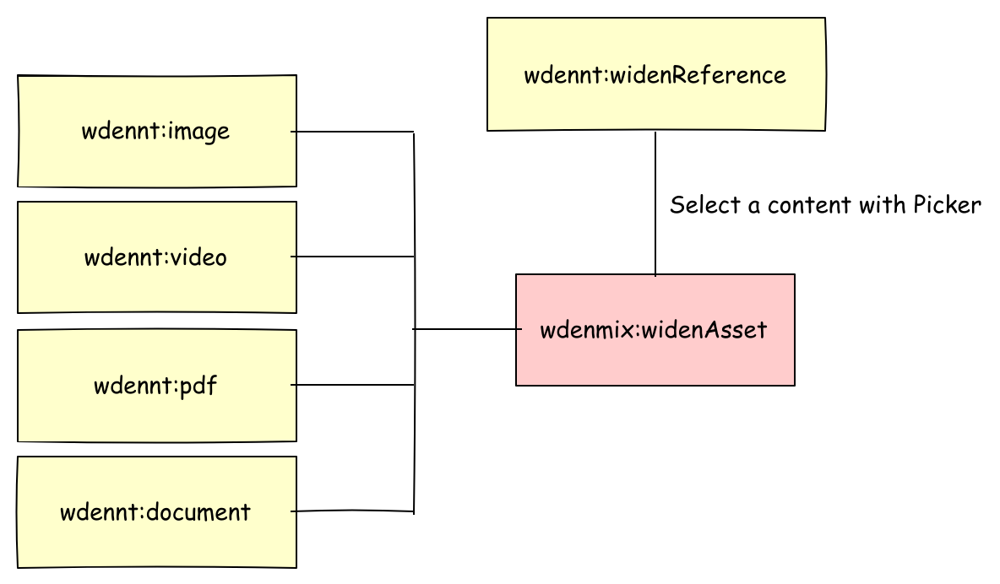

\[[<< back][README.md]\]
# Widen asset in jContent
jContent v7 restricts the usage of a picker to a *jcr* node only. Thus, to pick an external Widen asset,
jContent must create a JCR node equivalent of this Widen asset.
A node is also useful to create a dedicated rendering through a set of views.

- [Architecture overview](#architecture-overview)
- [wdennt:widenReference](#wdenntwidenreference)
    - [Definition](#definition)
        - [wdenmix:widenAsset](#wdenmixwidenasset)
        - [wdenmix:embed](#wdenmixembed)
        - [wdenmix:fileProperties](#wdenmixfileproperties)
    - [Views](#views)
        - [wdenmix:imageMediaSettings](#wdenmiximagemediasettings)
        - [wdenmix:pdfMediaSettings](#wdenmixpdfmediasettings)
- [wdennt:image](#wdenntimage)
    - [Definition](#definition-1)
        - [wdenmix:imageFileProperties](#wdenmiximagefileproperties)
    - [Views](#views-1)
- [wdennt:video](#wdenntvideo)
    - [Definition](#definition-2)
        - [wdenmix:videoFileProperties](#wdenmixvideofileproperties)
        - [wdenmix:embedVideo](#wdenmixembedvideo)
    - [Views](#views-2)
- [wdennt:pdf](#wdenntpdf)
    - [Definition](#definition-3)
        - [wdenmix:pdfFileProperties](#wdenmixpdffileproperties)
        - [wdenmix:embedPdf](#wdenmixembedpdf)
    - [Views](#views-3)
- [wdennt:document](#wdenntdocument)
    - [Definition](#definition-4)
    - [Views](#views-4)

## Architecture overview
The node type architecture, implemented in this module, is designed to be easily extended
by a customer or his integrator.
Indeed, a customer can create in Widen his own metadata type. So, this module cannot cover
all the possible case. But, new multimedia node types can be easily created.

The module provides multiple mixins (explained later) and 5 node types :
1. `wdennt:widenReference`
1. `wdennt:image`
1. `wdennt:video`
1. `wdennt:pdf`
1. `wdennt:document`

The hierarchy between them is presented in the schema below :



From this 5 node types only `wdennt:widenReference` is accessible through the *create menu*.
 
> Node types and mixin definitions, discussed later in this section, are written in the file
[definition.cnd].
> 
## wdennt:widenReference
This node type is the only one accessible through the *create menu*. In other words,
to add a widen asset into a page, a contributor must create a new `wdennt:widenReference` alias **Widen** in the UI.


### Definition
This node type is defined like this :
```cnd
[wdennt:widenReference] > jnt:content,jmix:nodeReference, jmix:multimediaContent
 - j:node (weakreference, picker[type='custom',config='widenPicker']) < 'wdenmix:widenAsset'
```

`wdennt:widenReference` extends 3 supertypes :
1. `jnt:content` : meaning the node type is a content node type
1. `jmix:multimediaContent` : meaning the node type appears in the **Content:Multimedia** menu entry (see image above)
1. `jmix:nodeReference` : meaning the node is like a *wrapper* used to reference a subset of mutlimedia nodes.
    this mixin provides a default attribute `j:node` used to store the path of the referenced node.

>In this defintion, the property `j:node` is overwritten. Indeed, we want to use a custom picker named [widenPicker][picker.md]
and restrict the allowed node type to be picked to node types that extend `wdenmix:widenAsset`.

#### Mixins
#### wdenmix:widenAsset
The mixin `wdenmix:widenAsset` defines a set of *jcr* properties used to map the properties common to all Widen assets and returned by 
the JSON api. As these properties are common to all Widen assets, each jContent node type must extend this mixin.

> the mapping process is covered in section [Widen Provider][provider.md].

The Widen API allows client to expand the JSON response with the *expand* query parameter
(cf. Widen documentation [Assets - List by search query][widenAPI:AssetByQuery] or [Assets - Retrieve by id][widenAPI:AssetById] ).

In our case we expand the response with **embeds**, **thumbnails** and **file_properties**. The JSON response returned by the API looks
like this: 

```json
{
    "id": "1eca8de8-f57b-4974-96e4-c7d24cb7a82d",
    "external_id": "jzrdv8kipa",
    "filename": "Image dog + cat in snow.jpg",
    "created_date": "2020-11-18T14:31:10Z",
    "last_update_date": "2020-11-18T16:17:58Z",
    "file_upload_date": "2020-11-18T14:31:10Z",
    "deleted_date": null,
    "released_and_not_expired": true,
    "asset_properties": null,
    "file_properties": {},
    "metadata": null,
    "metadata_info": null,
    "security": null,
    "status": null,
    "thumbnails": {},
    "embeds": {},
    "expanded": {},
    "_links": {}
}
```
The common properties to map are :
`id`, `external_id`, `filename`, `created_date`, `last_update_date`, `deleted_date` and `thumbnails`.

Thus, the definition of the mixin looks like this :
```cnd
[wdenmix:widenAsset] > jmix:structuredContent, jmix:tagged, jmix:keywords, mix:title mixin
 - wden:id (string) fulltextsearchable=no
 - wden:externalId (string) fulltextsearchable=no
 - wden:filename (string) fulltextsearchable=no
 - wden:createdDate (string) fulltextsearchable=no
 - wden:updatedDate (string) fulltextsearchable=no
 - wden:deletedDate (string) fulltextsearchable=no
 - wden:thumbnail (string) fulltextsearchable=no
```

As discussed before, the API is expanded with **embeds**, **thumbnails** and **file_properties**.
`embeds` and `file_properties` JSON objects depend on the asset type returned by the API. But, they also contain common properties.
Thus, the module contains 2 other mixins `wdenmix:embed` and `wdenmix:fileProperties` to map these common properties.

#### wdenmix:embed
The mixin `wdenmix:embed` is used to map the common properties available in the `embeds` object returned by the Widen API.

```json
{
    "id": "1eca8de8-f57b-4974-96e4-c7d24cb7a82d",
    
    "embeds": {
        "(àX()": {},
        "640px-landscape": {},
        "640px-portrait": {},
        "Facebook-cover": {},
        "PostFacebook/Instagram": {},
        "Website": {},
        "original": {},
        
        "templated": {
            "url": "https://embed.widencdn.net/img/<acme>/jzrdv8kipa/{size}px@{scale}x/Image-dog--cat-in-snow.jpg?q={quality}&x.template=y",
            "html": null,
            "share": null,
            "apps": []
        }
    },
    
}
```
The module only maps the property `embeds.templated.url`. So the mixin definition looks like this :
```cnd
[wdenmix:embed] mixin
 - wden:templatedUrl (string) fulltextsearchable=no
```

#### wdenmix:fileProperties
The mixin `wdenmix:fileProperties` is used to map the common properties available in the `file_properties`
object returned by the Widen API.

```json
{
    "id": "1eca8de8-f57b-4974-96e4-c7d24cb7a82d",
    
    "file_properties": {
        "format": "JPEG",
        "format_type": "image",
        "size_in_kbytes": 2255,
        "image_properties": {},
        "video_properties": null
    },
    
}
```
In the case above, the asset is an image, so `image_properties` is an object and `video_properties` is null.
Indeed, These properties are respectively populated only if the asset is an image or a video.

The common properties are `format`, `format_type` and `size_in_kbytes`.
 
The mixin definition looks like this :

```cnd
[wdenmix:fileProperties] mixin
 - wden:format (string)
 - wden:type (string)
 - wden:sizeKB (long)
```

### Views
The module provides a [default view][widenReference.jsp] 
for the node type. This view is in charge to call the appropriate view for the content in reference.

Template parameters are defined to provide a set of image width in case content in reference is an image or
the pdf viewer height in case the content in reference is a PDF.

These parameters are contributed from the UI.
Enable **Image Advanced Settings** in case of image or **PDF Advanced Settings** in case of PDF.

![005]

These parameters are defined by the mixins `wdenmix:imageMediaSettings` and `wdenmix:pdfMediaSettings`.

#### wdenmix:imageMediaSettings
```cnd
[wdenmix:imageMediaSettings] mixin
 extends = wdennt:widenReference
 itemtype = content
 - wden:defaultImageSize (long)
 - wden:imageSizes (long) multiple
```
#### wdenmix:pdfMediaSettings
```cnd
[wdenmix:pdfMediaSettings] mixin
 extends = wdennt:widenReference
 itemtype = content
 - wden:pdfMinHeight (long)
```

If needed, you can create your own mixin to extend `wdennt:widenReference`
and offer the contributor the capacity fine-tuning a specific content.

## wdennt:image
This node type is used to map a Widen Asset of type *image* : `file_properties.format_type = 'image'`.
A `wdennt:image` node has a dedicated set of properties and views.


### Definition
This node type is defined like this :
```cnd
[wdennt:image] > jnt:content, wdenmix:widenAsset, wdenmix:imageFileProperties, wdenmix:embed
```

`wdennt:image` extends 4 supertypes :
1. `jnt:content` : the node type is a content node type
1. `wdenmix:widenAsset` : the node inherits properties of the mixin ([+](#wdenmixwidenasset))
1. `wdenmix:imageFileProperties` : the node inherits properties of the mixin ([+](#wdenmiximagefileproperties))
1. `wdenmix:embed` : the node inherits properties of the mixin ([+](#wdenmixembed))

The node type doesn't have specific property. All the property comes from supertypes.

#### Mixin

#### wdenmix:imageFileProperties
The mixin `wdenmix:imageFileProperties` extends the mixin `wdenmix:fileProperties` and inherits its
properties ([+](#wdenmixfileproperties)). The mixin is used to map the specifics `file_properties.image_properties`
JSON properties returned for an image asset.

For an image, those properties are `width`, `height`, and`aspect_ratio` as presented in the JSON below.

```json
{
    "id": "1eca8de8-f57b-4974-96e4-c7d24cb7a82d",
    
    "file_properties": {
        "format": "JPEG",
        "format_type": "image",
        "size_in_kbytes": 2255,
        "image_properties": {
            "width": 4288.0,
            "height": 2848.0,
            "aspect_ratio": 1.505617977528
        },
        "video_properties": null
    },
    
}
```

To store those properties, the mixin is defined like this :
```cnd
[wdenmix:imageFileProperties] > wdenmix:fileProperties mixin
 - wden:width (double)
 - wden:height (double)
 - wden:aspectRatio (double)
```

### Views
The module provides 2 views:
1. a [default view][image.jsp] which return the HTML tag 

    ```jsp
    " 
         srcset="<widen cdn image urls for each selected width>"
         sizes="<prefered image sizes based on element width>"
         class="<css classname to apply>"
         alt="<filename>"
    />
    ``` 
    The widen cdn image URL is the value stored in the property `wden:templatedUrl`.
    This value contains variables `{size}`, `{scale}` and `{quality}` (cf. [json](#wdenmixembed)) resolved by the view.
    This allows the user (cf. [Image Advanced Settings](#views))
    or the template integrator to get the image with the desired size (`defaultWith` : 768).
    
    A srcset can also be created based on width in a list (`widths` : [256, 512, 768, 1024, 1280, 1600, 2000]).
    
    Other variables can be provided to the view to customize the rendering of the tag :
    * `sizes` : default `'(min-width: 600px) 1024px, 512px'`
    * `class` : no default value

1. an [hidden view][image.hidden.getSrc.jsp]

    ```jsp
    <c:set target="${moduleMap}" property="src" value="${src}" />
    <c:set target="${moduleMap}" property="srcset" value="${srcset}" />
    ```
    This view return the image src and srcset resolved in the same way as we did for the default view.
    Here the view doesn't return an HTML tag, but only variables which can be used by the caller this way :
    ```jsp
    <template:include view="hidden.getSrc">
        <template:param name="widths" value="1024"/>
        <template:param name="defaultWidth" value="1024"/>
    </template:include>
    
    <div class="scaling-image h-100">
        <div class="frame h-100">
            <div class="feature-img-bg h-100" style="background-image: url('${moduleMap.src}');">
            </div>
        </div>
    </div>
    ```
    > To resolve the case above, **best practice** should be to create a dedicated **tag library** to resolve the URL.
    Feel free to contribute.
    
    
## wdennt:video
This node type is used to map a Widen Asset of type *video* : `file_properties.format_type = 'video'`.
A `wdennt:video` node has a dedicated set of properties and views.


### Definition
This node type is defined like this :
```cnd
[wdennt:video] > jnt:content, wdenmix:widenAsset, wdenmix:videoFileProperties, wdenmix:embedVideo
```

`wdennt:video` extends 4 supertypes :
1. `jnt:content` : the node type is a content node type
1. `wdenmix:widenAsset` : the node inherits properties of the mixin ([+](#wdenmixwidenasset))
1. `wdenmix:videoFileProperties` : the node inherits properties of the mixin ([+](#wdenmixvideofileproperties))
1. `wdenmix:embedVideo` : the node inherits properties of the mixin ([+](#wdenmixembedvideo))

The node type doesn't have specific property. All the property comes from supertypes.

#### Mixins

#### wdenmix:videoFileProperties
The mixin `wdenmix:videoFileProperties` extends the mixin `wdenmix:imageFileProperties` and inherits its
properties ([+](#wdenmiximagefileproperties)). The mixin is used to map the specifics `file_properties.video_properties`
JSON properties returned for a video asset.

For a video, those properties are `width`, `height`, `aspect_ratio`, and `duration` as presented in the JSON below.

```json
{
    "id": "2eca8de8-f57b-4974-96e4-c7d24cb7a82f",
    
    "file_properties": {
        "format": "MPEG4",
        "format_type": "video",
        "size_in_kbytes": 11962,
        "image_properties": null,
        "video_properties": {
            "width": 1080.0,
            "height": 1920.0,
            "aspect_ratio": 0.562,
            "duration": 8.88
        }
    },
    
}
```

To store those properties, the mixin is defined like this :
```cnd
[wdenmix:videoFileProperties] > wdenmix:imageFileProperties mixin
 - wden:duration (double)
```

#### wdenmix:embedVideo
The mixin `wdenmix:embedVideo` extends the mixin `wdenmix:embed` and inherits its
properties ([+](#wdenmixembed)). The mixin is used to map the specifics `embeds` JSON properties
returned for a video asset.

For a video, those properties are :
* `video_player.url`
* `video_stream.url`
* `video_stream.html`
* `video_poster.url`

as presented in the JSON below.
```json
{
    "id": "2eca8de8-f57b-4974-96e4-c7d24cb7a82f",
    
    "embeds": {
        "VideoWithPlayerAndDownload": {},
        "video_player": {
            "url": "https://acme.widen.net/view/video/87tlstii2j/08_Aout.mp4?u=2spbki",
            "html": "<div style=\"position:relative;width:100%;height:0;padding-bottom:56.25%;\"><iframe src=\"https://acme.widen.net/view/video/87tlstii2j/08_Aout?u=2spbki\" webkitallowfullscreen mozallowfullscreen allowfullscreen frameborder=\"0\" allowtransparency=\"true\" scrolling=\"no\" style=\"position:absolute;top:0;left:0;width:100%;height:100%;\" ></iframe></div>",
            "share": "https://acme.widen.net/view/video/87tlstii2j/08_Aout.mp4?u=2spbki&x.share=t",
            "apps": []
        },
        "video_poster": {
            "url": "https://acme.widen.net/content/87tlstii2j/jpeg/08_Aout.jpg?u=2spbki",
            "html": "",
            "share": "https://acme.widen.net/view/thumbnail/87tlstii2j/08_Aout.jpg?t.format=jpeg&u=2spbki&x.share=t",
            "apps": []
        },
        "video_stream": {
            "url": "https://acme.widen.net/content/87tlstii2j/mp4/08_Aout.mp4?quality=hd&u=2spbki",
            "html": "<video controls><source src=\"https://acme.widen.net/content/87tlstii2j/mp4/08_Aout.mp4?quality=hd&u=2spbki\" type=\"video/mp4\"></video>",
            "share": "https://acme.widen.net/view/video/87tlstii2j/08_Aout.mp4?u=2spbki&x.share=t",
            "apps": []
        }
        
    },
    
}
```

To store those properties, the mixin is defined like this :
```cnd
[wdenmix:embedVideo] > wdenmix:embed  mixin
 - wden:videoPlayer (string) fulltextsearchable=no
 - wden:videoStreamURL (string) fulltextsearchable=no
 - wden:videoStreamHTML (string) fulltextsearchable=no
 - wden:videoPoster (string) fulltextsearchable=no
```

Those properties are used by views to display HTML5 video players.

### Views
The module provides 3 views :
1. a [default view][video.jsp] which return the Widen video player
    loaded through an iframe. The iframe src is the value stored in the property `wden:videoPlayer`.

1. a [VJS video player view][video.player.vjs.jsp] which use the
    [Video-js player][videojs.com] to play the video. The player is configured with `wden:videoStreamURL` and 
    `wden:videoPoster`.

1. a [native HTML5 player view][video.stream.jsp] which return the value
    of `wden:videoStreamHTML`. The view uses directly the HTML code returned by the Widen API with few css adjustments.

## wdennt:pdf
This node type is used to map a Widen Asset of type *pdf* : `file_properties.format_type = 'pdf'`.
A `wdennt:pdf` node has a dedicated set of properties and views.

### Definition
This node type is defined like this :
```cnd
[wdennt:pdf] > jnt:content, wdenmix:widenAsset, wdenmix:pdfFileProperties, wdenmix:embedPdf
```

`wdennt:pdf` extends 4 supertypes :
1. `jnt:content` : the node type is a content node type
1. `wdenmix:widenAsset` : the node inherits properties of the mixin ([+](#wdenmixwidenasset))
1. `wdenmix:pdfFileProperties` : the node inherits properties of the mixin ([+](#wdenmixfileproperties)).
1. `wdenmix:embedPdf` : the node inherits properties of the mixin ([+](#wdenmixembedpdf))

The node type doesn't have specific property. All the property comes from supertypes.

#### Mixin

#### wdenmix:pdfFileProperties
The mixin `wdenmix:pdfFileProperties` extends the mixin `wdenmix:fileProperties` and inherits its
properties. PDF asset only uses properties common to files, so the mixin is defined like this :
```cnd
[wdenmix:pdfFileProperties] > wdenmix:fileProperties mixin
```

#### wdenmix:embedPdf
The mixin `wdenmix:embedPdf` extends the mixin `wdenmix:embed` and inherits its
properties ([+](#wdenmixembed)). The mixin is used to map the specifics `embeds` JSON properties returned for a video asset.

For a video, those properties are :
* `document_html5_viewer.url`
* `document_viewer.url`
* `document_thumbnail.url`
* `original.url`
* `original.html`

as presented in the JSON below.
```json
{
    "id": "866b23a5-442b-4f31-8cf7-5b27363f35be",
    
    "embeds": {
        "document_html5_viewer": {
            "url": "https://acme.widen.net/view/pdf/utqlxflgpa/acme_overview.pdf?u=2spbki",
            "html": "<iframe src=\"https://acme.widen.net/view/pdf/utqlxflgpa/acme_overview.pdf?u=2spbki\" webkitallowfullscreen mozallowfullscreen allowfullscreen ></iframe>",
            "share": "https://acme.widen.net/view/pdf/utqlxflgpa/acme_overview.pdf?u=2spbki&x.share=t",
            "apps": []
        },
        "document_thumbnail": {
            "url": "https://acme.widen.net/content/utqlxflgpa/jpeg/acme_overview.jpg?u=2spbki",
            "html": "",
            "share": "https://acme.widen.net/view/thumbnail/utqlxflgpa/acme_overview.pdf?t.format=jpeg&u=2spbki&x.share=t",
            "apps": []
        },
        "document_viewer": {
            "url": "https://acme.widen.net/content/utqlxflgpa/pdf/acme_overview.pdf?u=2spbki",
            "html": "<iframe src=\"https://acme.widen.net/content/utqlxflgpa/pdf/acme_overview.pdf?u=2spbki\" webkitallowfullscreen mozallowfullscreen allowfullscreen ></iframe>",
            "share": "https://acme.widen.net/view/pdf/utqlxflgpa/acme_overview.pdf?u=2spbki&x.share=t",
            "apps": []
        },
        "original": {
            "url": "https://acme.widen.net/content/utqlxflgpa/original/acme_overview.pdf?u=2spbki&download=true",
            "html": "<a href=\"https://acme.widen.net/content/utqlxflgpa/original/acme_overview.pdf?u=2spbki&download=true\" target=\"_blank\">acme_overview.pdf</a>",
            "share": "https://acme.widen.net/content/utqlxflgpa/original/acme_overview.pdf?u=2spbki&download=true&x.share=t",
            "apps": []
        },
        
    },
    
}
```

To store those properties, the mixin is defined like this :
```cnd
[wdenmix:embedPdf] > wdenmix:embed  mixin
 - wden:viewerHtml5 (string) fulltextsearchable=no
 - wden:viewer (string) fulltextsearchable=no
 - wden:docThumbnail (string) fulltextsearchable=no
 - wden:docURL (string) fulltextsearchable=no
 - wden:docHTMLLink (string) fulltextsearchable=no
```

Those properties are used by views to display pdf node within an HTML5 view or like a link.

### Views
The module provides 3 views :
1. a [default view][pdf.jsp] which return the Widen PDF viewer
    loaded through an iframe. The iframe src is the value stored in the property `wden:viewer`.
    The minimal height of the viewer can be forced by the user (cf. [PDF Advanced Settings](#views-1))
    or the template integrator (`pdfMinHeight` : 512).

1. a [HTML5 viewer][pdf.viewerHTML5.jsp] which use the
    native pdf viewer loaded through an iframe. TThe iframe src is the value stored in the 
    property `wden:viewerHtml5`.
    The minimal height of the viewer can be forced by the user (cf. [PDF Advanced Settings](#views-1))
    or the template integrator (`pdfMinHeight` : 512).

1. a [link][pdf.link.jsp] which return the value
    of `wden:docHTMLLink`. The view uses directly the HTML code returned by the Widen API.


## wdennt:document
This node type is used to map a Widen Asset which is not *image*, *video* or *pdf*. It is the default
node type. A `wdennt:document` node extends the generic mixins.

### Definition
This node type is defined like this :
```
[wdennt:document] > jnt:content, wdenmix:widenAsset, wdenmix:fileProperties
```

`wdennt:document` extends 3 supertypes :
1. `jnt:content` : the node type is a content node type
1. `wdenmix:widenAsset` : the node inherits properties of the mixin ([+](#wdenmixwidenasset))
1. `wdenmix:fileProperties` : the node inherits properties of the mixin ([+](#wdenmixfileproperties))

The node type doesn't have specific property. All the property comes from supertypes.
Those properties are used by views to display pdf node within an HTML5 view or like a link.

### Views
The module provides a default empty view. Feel free to customize it.

\[[< back][README.md]\]

<!--
[040]: ../images/040_nodeArch.png
[0011]: ../images/0011_menuSelect2.png
-->
[005]: ../images/005_widenReferenceSelected.png

[definition.cnd]: ../../src/main/resources/META-INF/definitions.cnd
[widenReference.jsp]: ../../src/main/resources/wdennt_widenReference/html/widenReference.jsp
[image.jsp]: ../../src/main/resources/wdennt_image/html/image.jsp
[image.hidden.getSrc.jsp]: ../../src/main/resources/wdennt_image/html/image.hidden.getSrc.jsp
[video.jsp]: ../../src/main/resources/wdennt_video/html/video.jsp
[video.player.vjs.jsp]: ../../src/main/resources/wdennt_video/html/video.player.vjs.jsp
[video.stream.jsp]: ../../src/main/resources/wdennt_video/html/video.stream.jsp
[pdf.link.jsp]: ../../src/main/resources/wdennt_pdf/html/pdf.link.jsp
[pdf.viewerHTML5.jsp]: ../../src/main/resources/wdennt_pdf/html/pdf.viewerHTML5.jsp
[pdf.jsp]: ../../src/main/resources/wdennt_pdf/html/pdf.jsp

[README.md]: ../../README.md
[provider.md]: ./provider.md
[picker.md]: ./picker.md

[videojs.com]: https://videojs.com
[widenAPI:AssetByQuery]: https://widenv2.docs.apiary.io/#reference/assets/assets/list-by-search-query
[widenAPI:AssetById]: https://widenv2.docs.apiary.io/#reference/assets/assets/retrieve-by-id