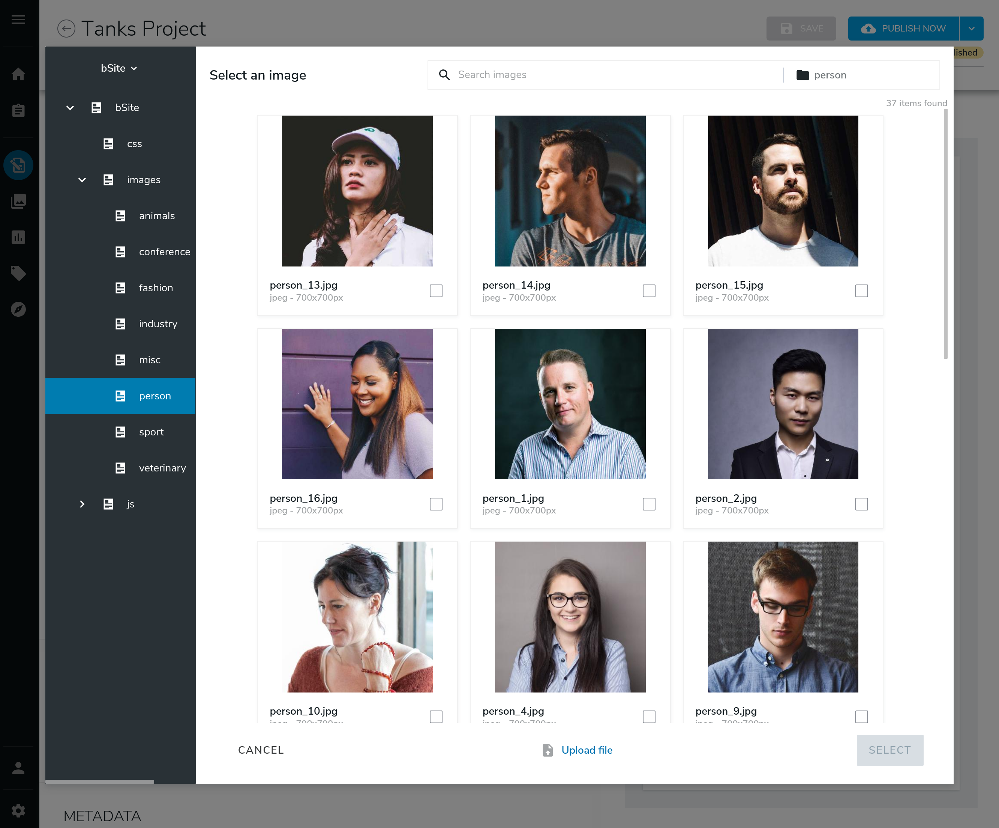
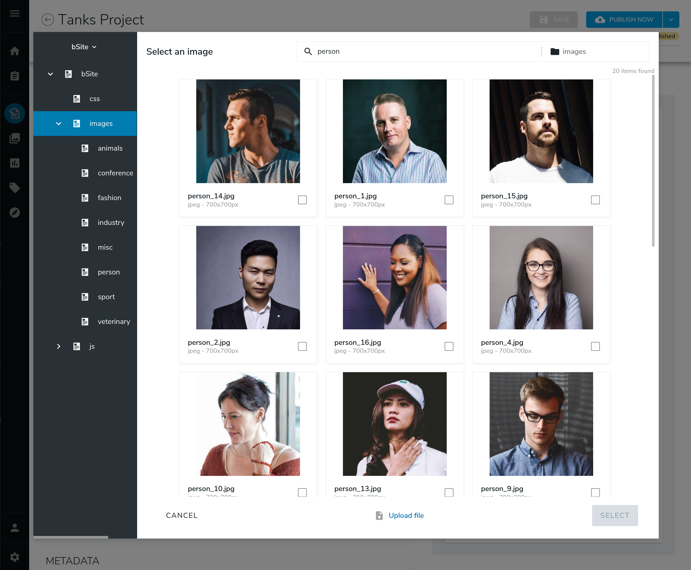
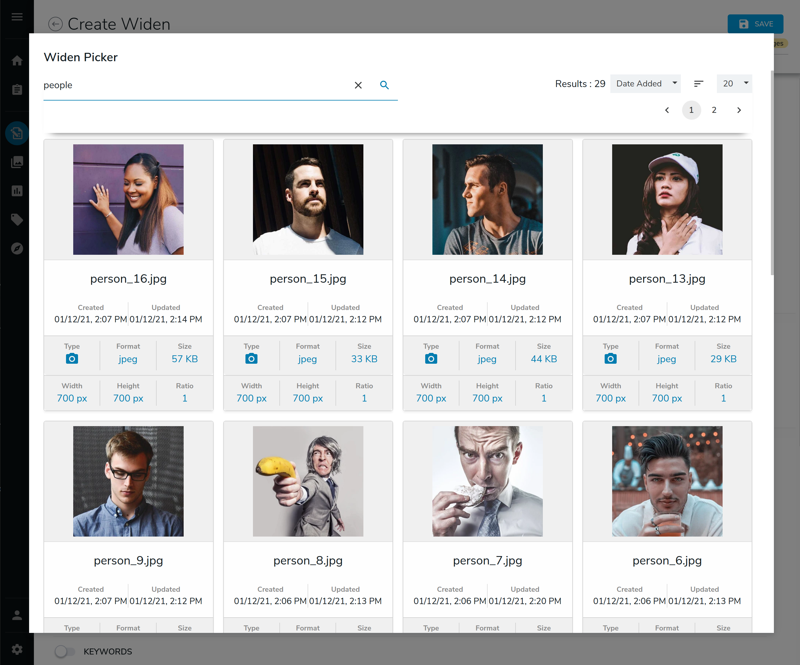
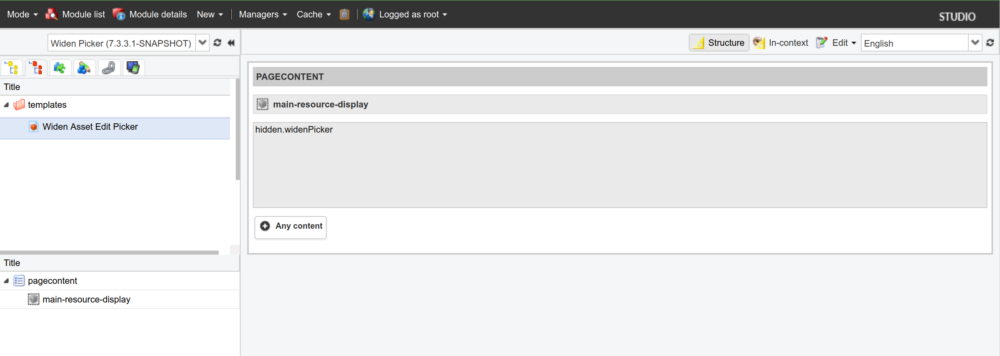

\[[<< back](../../README.md)\]
# Widen Picker
This section presents details about the picker used by a contributor to search and select a widen content from
a jContent node.
Before to deep dive into the widen picker, few words about the default jContent picker.

## Reminder about picker
A picker is a user interface used by a jContent contributor to search and select a referenced node/content from
  a master node/content form field. In other words, this is the way to create a reference between two nodes/contents.
  
With a picker, a contributor can
1. Browse a content tree (internal or external)

    
2. Run a fulltext search through metadata like name or tags

    
3. Upload a binary (text file, image, video...) from the file system
4. Select the content to reference

Thus, jContent provides a default picker working with all JCR nodes, and there is a dedicated section where
a contributor can browse external repositories.

However, this module doesn't use the default picker, because :
1. The search UI of the default picker doesn't support search facets.
2. The search UI is a bit complex to extend, if you want to support facets.

So, we have decided to create our own picker. 



Note : Even if, for the moment, this modules doesn't use facet approach,
the picker is ready to use one and easy to extend.


## Components
The picker is based on a standalone REACT application.
This application is a frontend of the Widen Asset API. The widen picker is used :
1. to search and select the appropriate media content in the widen asset catalog.
2. to create and returned a node path to jContent. This path is resolved later by the [provider](./provider.md)
to create the node.

Even if the picker is a standalone REACT application, it must be linked to jContent to reference the selected
widen asset as a JCR node. This link is done via a Javascript interface.

### Overview


The jContent widen picker is composed by three mains elements :
1. A Javascript Interface written in the file [widen-asset-picker.js](../../src/main/resources/javascript/edit-mode/widen-asset-picker.js).
2. A content view for an *nt:base* node, and named [hidden.widenPicker.jsp](../../src/main/resources/nt_base/html/base.hidden.widenPicker.jsp).
this view is displayed through a *main resource display* template named `widen-asset-edit-picker`.

3. A [React application](../../src/REACT/src/index.js)


#### Data flow
1. The user click the GWT form field *Media Content*.
2. The iframe with the *nt:base* node view is loaded.
3. The React application is launched by the view. Depending on the configuration (lazy loading is possible), the application
requests the last updated content to Widen.

    The picker uses the Widen API :
    [Assets - List by search query](https://widenv2.docs.apiary.io/#reference/assets/assets/list-by-search-query).
4. The React application displays the assets returned by the API.
5. The user selects a Widen asset.

### Javascript Interface
The javascript interface is the bridge between the content form, and the picker to exchange data.
It is splited in two parts, one from jContent side ([widen-asset-picker.js](../../src/main/resources/javascript/edit-mode/widen-asset-picker.js))
and the other one from the react app ([widenPickerInterface object](../../src/REACT/src/index.js)).

#### Architecture

From jContent side, the interface is composed by three main functions :
1. `widenPickerInit()`. This function creates and returns an iframe HTML tag.
    ```
    const iframe = `<iframe 
        id="${__widenFrameID__}" width="100%" height="100%" frameborder="0"
        src="${jahiaGWTParameters.contextPath}${jahiaGWTParameters.servletPath}/editframe/default/${jahiaGWTParameters.lang}/sites/${jahiaGWTParameters.siteKey}.widen-asset-edit-picker.html"/>`
    return $.parseHTML(iframe)[0];
    ```

    The src of this iframe is the url of the *main resource display* template named `widen-asset-edit-picker`.
    This template calls the view [hidden.widenPicker.jsp](../../src/main/resources/nt_base/html/base.hidden.widenPicker.jsp).
    
    
    
    The view loads the build of the picker React application and runs the script
    ```
    <%-- Load the build --%>
    <template:addResources type="javascript" resources="REACTBuildApp/2.4ff4ff0b.chunk.js" />
    <template:addResources type="javascript" resources="REACTBuildApp/main.8e3d683f.chunk.js" />
    
   ...
   
    <%-- Run the app --%>
    !function(e){function r(r){for(var n,i,l=r[0],p=r[1],f=r[2],...
   ```
2. `widenPickerLoad(data)`. This function provides to the `widenPickerInterface` the current value of the form field.
3. `widenPickerGet()`. This function is called when the contributor clicks the *save* button of the picker.
The function get from the `widenPickerInterface` the node path of the selected asset and return it to jContent.
    ```
    const pickerInterface = getCustomWidenPickerInterface();
    if(pickerInterface !== undefined) {
        return pickerInterface.data;
    }
    ```

#### Configuration
The picker is declared in the [content definition file](../../src/main/resources/META-INF/definitions.cnd),
```
[wdennt:widenReference] > jnt:content,jmix:nodeReference, jmix:multimediaContent
 - j:node (weakreference, picker[type='custom',config='widenPicker']) < 'wdenmix:widenAsset'
```
Based one this definition, jContent knows that it must use a custom picker configured by the `widenPicker` config.
This configuration is made in the spring configuration file [widen-picker.xml](../../src/main/resources/META-INF/spring/widen-picker.xml).

First of all, the functions in the [widen-asset-picker.js](../../src/main/resources/javascript/edit-mode/widen-asset-picker.js)
file must be set in the javascriptResources pool for GWT.
```
<bean class="org.jahia.ajax.gwt.helper.ModuleGWTResources">
    <property name="javascriptResources">
        <list>
            <value>/modules/widen-picker/javascript/edit-mode/widen-asset-picker.js</value>
        </list>
    </property>
</bean>
```
Then the functions can be used in the `widenPicker` configuration.
```
<bean id="widenPicker" class="org.jahia.services.uicomponents.bean.contentmanager.ManagerConfiguration">
    <property name="titleKey" value="label.wdenAsset@resources.widen-picker"/>
    <property name="customPickerConfiguration">
        <bean class="org.jahia.ajax.gwt.client.widget.content.CustomPickerConfiguration">
            <property name="initMethodName" value="widenPickerInit"/>
            <property name="loadFieldValueMethodName" value="widenPickerLoad"/>
            <property name="getFieldValueFromPickerMethodName" value="widenPickerGet"/>
        </bean>
    </property>
</bean>
```
the `widenPickerInterface` object called in the functions above is declared in the [index](../../src/REACT/src/index.js)
of the React application.

```
const widenPickerInterface = {
    _context: {},
    _data: [],

    get context() {
        return this._context;
    },
    get data(){
        return this._data;
    },
    ...
}
...
```
Finally, the object is defined as a global javascript variable attached to the window js object.
Like this, the `widenPickerInterface` is accessible at the iframe level.
```
...
window.widenPickerInterface = widenPickerInterface;
```

### Widen picker React application
Standalone application Front end of the Widen API. Allways synch with Widen catalog
#### Architecture


#### Configuration
config is done in the [hidden.widenPicker.jsp](../../src/main/resources/nt_base/html/base.hidden.widenPicker.jsp).
Read the config variable declare in the file jahia.properties (cf. [prerequisites](../../README.md#prerequisites)).

```
<%
    Properties properties = (Properties) (Properties) SpringContextSingleton.getBean("jahiaProperties");
    String APIProtocol = properties.getProperty("jahia.widen.api.protocol");
    String APIEndPoint = properties.getProperty("jahia.widen.api.endPoint");
    String APISite = properties.getProperty("jahia.widen.api.site");
    String APIToken = properties.getProperty("jahia.widen.api.token");
    String APIVersion = properties.getProperty("jahia.widen.api.version");
    String JCRMountPoint = properties.getProperty("jahia.widen.edp.mountPoint");
%>
```
Then populate a js context object 
```
const context_${targetId}={
    widen:{
        url:"<%= APIProtocol %>://<%= APIEndPoint %>",
        version:"<%= APIVersion %>",
        site:"<%= APISite %>",
        token:"<%= APIToken %>",
        mountPoint:"<%= JCRMountPoint %>"
    }
};
```
Finally, when the react widenPicker is ready, it is call with the context.
```
window.widenPicker("${targetId}",context_${targetId});
```

Note : You can add more variables in the context if you want to create new features or enhance current features
in the React application.
For example, you could expose the timeout variable, or the default result per page, etc.
To do it, you must follow these steps :
1. create a new property in the jahia.properties
2. in the view [hidden.widenPicker.jsp](../../src/main/resources/nt_base/html/base.hidden.widenPicker.jsp), get the property and add it to the context object
3. declare this new property in the [validation schema](../../src/REACT/src/douane/lib/schema/index.js)
4. read/map/use the property to the [store](../../src/REACT/src/components/Store/Store.jsx).
By default, the store exposes the context, so the property can be accessed where you want.


\[[<< back](../../README.md)\]