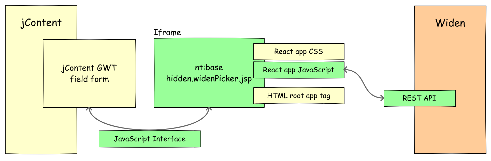

\[[<< back](../../README.md)\]
# Widen Picker
The picker is a standalone REACT application. This application is user frontend to interact with the Widen Asset API.
In jContent, the picker is used :
1. to search and select in the widen asset catalog the appropriate media content.
2. to create and returned a node path to jContent. This path is resolved later by the [provider](./provider.md).

By default jContent provide a default picker working with all JCR nodes. There is a dedicated section where
a user can browse external repositories. There is also a full text search area.
But, this module doesn't use the default picker !
1. The search UI of the default picker doesn't support facets.
2. The search UI is a bit complex to extend, if you want to support facets.

Even if, for the moment, this modules doesn't use facet approach,
the picker is ready to use one and easy to extend.

## Architecture

### Components


The jContent widen picker is composed by three mains elements :
1. A [Javascript Interface](../../src/main/resources/javascript/edit-mode/widen-asset-picker.js).
2. A content view for nt:base named [hidden.widenPicker.jsp](../../src/main/resources/nt_base/html/base.hidden.widenPicker.jsp).
3. A [React application](../../src/REACT/src/index.js)


### Content flow
1. The user click the GWT form field *Media Content*
2. The iframe with the nt:base view is loaded. -> explain how interface function
3. The React application is started. Based on configuration (lazyloading is possible), the application
request the last update content to Widen. The picker uses the Widen API :
[Assets - List by search query](https://widenv2.docs.apiary.io/#reference/assets/assets/list-by-search-query).
4. The React application displays the assets returned by the API
5. The user select a Widen asset. -> explain how interface function


As explained before the picker is standalone REACT application. As describe in the schema above, the application
is loaded via a content view for nt:base named [hidden.widenPicker.jsp](../../src/main/resources/nt_base/html/base.hidden.widenPicker.jsp).
This view is loaded by an iframe which pop up when user click the Media Content form field.
used to link the GWT form field to the 
The field form is linked to the iframe through a javascript interface.


As presented in the [data flow](../../README.md#data-flow), the provider maps a Widen asset (JSON) to a jContent node (JCRNodeWrapper).
The mapping is done in 3 steps :
1. Resolve the path returned by the picker `jahia.widen.edp.mountPoint`/`id` of the widen asset
2. Query Widen API to get the properties of the asset
3. Map the JSON to a JCRNodeWrapper

Steps 1 & 2 are done in [WidenDataSource.java](../../src/main/java/org/jahia/se/modules/widenprovider/WidenDataSource.java)
and steps 3 is done in [WidenAssetDeserializer.java](../../src/main/java/org/jahia/se/modules/widenprovider/model/WidenAssetDeserializer.java)
### Resolve the path

### Query Widen API

#### Before to Query check the cache !
To avoid not necessary call, the module use a dedicated
cache to store jContent nodes created after a widen call. The name of this cache is "cacheWiden".
The cache is set up in the function :
[start()](../../src/main/java/org/jahia/se/modules/widenprovider/WidenDataSource.java).

This cache is configured to keep 1 hour (3600s) an idle object and finally to remove an object after 8 hours (28800s).
The configuration looks like this :
```
CACHE_NAME = "cacheWiden";
TIME_TO_LIVE_SECONDS = 28800;
TIME_TO_IDLE_SECONDS = 3600;
```

#### Query Widen API
If the requested node is not in cache, the provider calls the Widen API from the funtion : [queryWiden()](../../src/main/java/org/jahia/se/modules/widenprovider/WidenDataSource.java)
to get all relevant information about the media content.

The provider use the Widen API : [Assets - Retrieve by id](https://widenv2.docs.apiary.io/#reference/assets/assets/retrieve-by-id).


### JSON to JCRNodeWrapper
The JSON return by the API is mapped to a JCR node object. To do this mapping we use the [jackson](https://github.com/FasterXML/jackson) library.

As the Widen JSON properties and the JCR node do not have the same names we created a custom
[deserializer](../../src/main/java/org/jahia/se/modules/widenprovider/model/WidenAssetDeserializer.java)
used by our class [WidenAsset](../../src/main/java/org/jahia/se/modules/widenprovider/model/WidenAsset.java)
to create a cacheable object :
```
@JsonDeserialize(using = WidenAssetDeserializer.class)
public class WidenAsset {
...
}
```

## Configuration
The picker is configured via a spring configuration file named [widen-picker.xml](../../src/main/resources/META-INF/spring/widen-picker.xml),
for the GWT part and this [node view](../../src/main/resources/nt_base/html/base.hidden.widenPicker.jsp) for the javascript part.


In this file, there is two main configuration part, one for the picker and the other one for the provider.
For the provider, two beans are configured :
 1. one to create the provider itsef
 
    ```
    <bean class="org.jahia.ajax.gwt.helper.ModuleGWTResources">
        <property name="javascriptResources">
            <list>
                <value>/modules/widen-picker/javascript/edit-mode/widen-asset-picker.js</value>
            </list>
        </property>
    </bean>
    ```
2. the other one to create the data source used by the provider. This configuration maps
variables declare in the file jahia.properties (cf. [prerequisites](../../README.md#prerequisites)).

    ```
    <bean id="widenPicker" class="org.jahia.services.uicomponents.bean.contentmanager.ManagerConfiguration">
        <property name="titleKey" value="label.wdenAsset@resources.widen-picker"/>
        <property name="customPickerConfiguration">
            <bean class="org.jahia.ajax.gwt.client.widget.content.CustomPickerConfiguration">
                <property name="initMethodName" value="widenPickerInit"/>
                <property name="loadFieldValueMethodName" value="widenPickerLoad"/>
                <property name="getFieldValueFromPickerMethodName" value="widenPickerGet"/>
            </bean>
        </property>
    </bean>
    ```
\[[<< back](../../README.md)\]