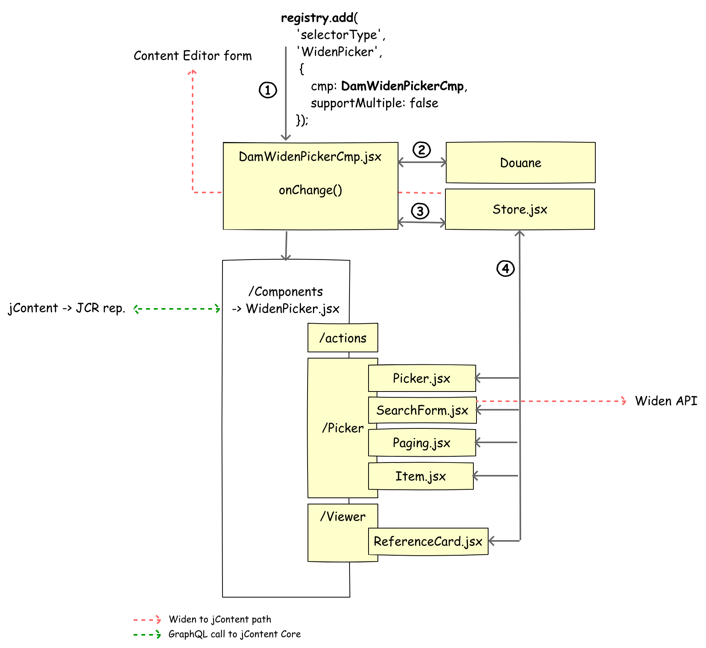

\[[<< back][README.md]\]
# Widen Picker

- [About the jContent picker](#about-the-jcontent-picker)
- [Components](#components)
    - [Overview](#overview)
    - [Application build and registration](#application-build-and-registration)
        - [Build the front application](#build-the-front-application)
        - [Registration flow](#registration-flow)
    - [Widen Picker React Application](#widen-picker-react-application)
        - [Architecture](#architecture)
        - [Configuration](#configuration)
        - [Run and deploy the App](#run-and-deploy-the-app)
        
This section presents details about the picker that contributors use to search and select Widen content from
a jContent node.

Before taking a deep dive into the Widen picker, you should understand the basics of the default jContent picker.

## About the jContent picker
A picker is a user interface (UI) used by a jContent contributor to search and select a referenced node or content from
  a master node or content form field. In other words, this is how to create a reference between two nodes or content.
  
With a picker, a contributor can:
* Browse an internal or external content tree.

    ![01_defaultPicker]
* Run a fulltext search with metadata like **name** or **tags**.

    ![02_defaultPicker]
* Upload a binary (such as a text file, image, or video) from the file system.
* Select content to reference.

jContent provides a default picker that works with all JCR nodes and there is a dedicated section where
a contributor can browse external repositories.

However, this module doesn't use the default picker because the search UI:
* of the default picker doesn't support search facets.
* is a bit complex to extend if you want to support facets.

So, we have decided to create our own picker, named `Widen Picker`: 

![003]

> Although for the moment this module doesn't use the facet approach,
the picker is ready to use one and is easy to extend.


## Components
The picker is based on a standalone REACT application.
This application is the frontend of the Widen Asset API. The Widen picker is used to:
* search and select the appropriate media content in the Widen assets catalog.
* create and return a node path to jContent. This path is resolved later by the [Widen provider][provider.md]
to create the node.

Even if the picker is a standalone REACT application, it must be linked to jContent to reference the selected
Widen asset as a JCR node. This link is done through a Javascript interface.

### Overview


The Content Editor extension **Widen Picker**  is mainly composed of a [React application][react:DamWidenPickerCmp] known as `WidenPicker`.
To be loaded, this application must be registered to jContent. For this purpose, Jahia has created
an npm/yarn module named `ui-extender`, which is a part of the `Webpack App Shell`
project in Jahia ([read more about App Shell][medium:AppShell]).

### Application build and registration
First of all, keep in mind that the **Widen Picker** is a React application built on the fly when
the module is deployed.
When the build is done, the application is loaded and the registration process starts.

#### Build the front application
In this documentation, we do not dig too much into details about how to build a front application
in a Jahia module, but rather give you an overview.

To deploy [nodejs], install [yarn] packages, and build the React application from Maven,
the module uses the [frontend-maven-plugin].
To build the module the plugin has to excute three steps:
1. Install the binary for node v11.15.0 and yarn v1.12.3.
2. Upload and install the yarn packages referenced in the [packages.json] file.
3. Run the build command `yarn webpack`.

To execute these steps, the plugin is configured in the [pom.xml] file as follows:

```xml
<plugin>
    <groupId>com.github.eirslett</groupId>
    <artifactId>frontend-maven-plugin</artifactId>
    <version>1.6</version>
    <!-- executions go here -->
    <executions>
        <execution>
            <id>npm install node and yarn</id>
            <phase>generate-resources</phase>
            <goals>
                <goal>install-node-and-yarn</goal>
            </goals>
            <configuration>
                <nodeVersion>v11.15.0</nodeVersion>
                <yarnVersion>v1.12.3</yarnVersion>
            </configuration>
        </execution>
        <execution>
            <id>yarn install</id>
            <phase>generate-resources</phase>
            <goals>
                <goal>yarn</goal>
            </goals>
        </execution>
        <execution>
            <id>yarn post-install</id>
            <phase>generate-resources</phase>
            <goals>
                <goal>yarn</goal>
            </goals>
            <configuration>
                <arguments>${yarn.arguments}</arguments>
            </configuration>
        </execution>
    </executions>
</plugin>
```

The Yarn arguments are:

```
<yarn.arguments>build -p</yarn.arguments>
<yarn.arguments>webpack</yarn.arguments>
```

The current release uses `webpack 5` and the new `ModuleFederationPlugin` to share libraries ([wepback.shared][wepback.shared.js]) between the picker module
and the jContent UI as written in the [webpack.config] file.

> Note: `ModuleFederationPlugin` replaces `DllReferencePlugin`.

```js
new ModuleFederationPlugin({
    name: "widenPickerPlugin",
    library: { type: "assign", name: "appShell.remotes.widenPickerPlugin" },
    filename: "remoteEntry.js",
    exposes: {
        './init': './src/javascript/init'
    },
    remotes: {
        '@jahia/app-shell': 'appShellRemote'
    },
    shared
})
```
The code above references the `widenPickerPlugin` and exposes the [./src/javascript/init][react.src.init.js] file as the
init entry point for the registration process

#### Registration flow

As mentioned previously, this application must be registered with jContent to be available in a content form.
The registration process is part of the the `Webpack App Shell` project.
As defined in the [webpack.config] file, the main entry of the application is the 
[./src/javascript/init][react.src.init.js] file:

```js
import {registry} from '@jahia/ui-extender';
import DamWidenPickerCmp from './DamWidenPicker';

export default function () {
    registry.add('callback', 'widenPickerEditor', {
        targets: ['jahiaApp-init:20'],
        callback: () => {
            registry.add('selectorType', 'WidenPicker', {cmp: DamWidenPickerCmp, supportMultiple: false});
            console.debug('%c WidenPicker Editor Extensions  is activated', 'color: #3c8cba');
        }
    });
}
```
In this file, we register a `'callback'` named `'widenPickerEditor'` which is executed during
the initialization of the Jahia UI with a priority of 20.

After the registration the `callback` property is executed.
It is a function which registers as a `'selectorType'` named `'WidenPicker'`.
The application used to render the selector is the `DamWidenPickerCmp` component.
The selector cannot be used by a content property which allows multiple values.
This component is the main entry of our Widen picker React application.

> the registry object comes from the yarn module `@jahia/ui-extender`

### Widen picker React application
The core of the Widen Picker is a React application used like a front end of the Widen API.
The application directly requests the Widen API and uses its search capabilities so the
assets returned are always synchronized with the Widen catalog.

> The picker uses the Widen API:
[Assets - List by search query][widenAPI:AssetByQuery].

#### Architecture



The registration process enable the application which starts in the
[DamWidenPickerCmp][react:DamWidenPickerCmp] (1) file where the context parameters
are checked based on the [douane's schema][react:douaneSchemaIndex.js] (2).
If a required parameter is missing, an error is returned.

Then, the sanitized context is sent to the [store][react:store.jsx] (3). The `store` is
a key part of the application. The `store` is the place where:
* all the actions are defined
* all the updates are made
* the `onChange` function (provided by *Content Editor*) is called with the selected value:

    ```js
    case 'UPDATE_SELECTED_ITEM_UUID': {
        const {uuid} = payload;
        const {editorOnChange} = state;
        const editorValue = uuid;
        editorOnChange(editorValue);
        ...
    }
    ```

The `store` is used by all the application components (4). These components are in charge of the UI rendering.
In Jahia v8, a selector has to use a component to render the selected content (aka viewer) and 
a component to render a picker (aka picker)
as illustrated in the images below.

Viewer
![appComponentViewer]

Picker
![appComponentPicker]


#### Configuration
As written before, the application directly requests the Widen API.
To execute a request, the application needs connexion parameters to join the Widen API endpoint.

These parameters are provided to the application via the [WidenPicker.jsp] configuration file.

First, we search for the mount point created by the module. The properties of the mount point are
a subset of the variables written in the file [mount-widen.cfg][mount.cfg] 
(see [post install][postInstall] to update the value of the property).

```jsp
<jcr:sql
    var="mountPoints"
    sql="SELECT * FROM [wdennt:mountPoint]"
/>
```
Then we create an **widen** object entry in the **contextJsParameters.config** object.
```js
contextJsParameters.config.widen={
    url:"${mountPoint.properties['wden:apiProtocol']}://${mountPoint.properties['wden:apiEndPoint']}",
    version:"${mountPoint.properties['wden:apiVersion']}",
    site:"${mountPoint.properties['wden:apiSite']}",
    token:"${mountPoint.properties['wden:apiToken']}",
    mountPoint:"${jcr:getChildrenOfType(mountPoint.properties.mountPoint.node,'jnt:contentFolder')[0].path}",
    lazyLoad:${mountPoint.properties['wden:lazyLoad']},
    resultPerPage:${mountPoint.properties['wden:resultPerPage']}
}
```
> This widen object is checked
  by the douane component of the application (cf. step 2 of the [architecture](#architecture-1)).

> You can add more properties in the context if you want to create new features or enhance current features
in the React application. For example, you could expose the timeout variable of the Widen API call or
the timout of the cache.


To add more properties in the widen object:
1. Add a new property to the `wdennt:mountPoint` node in the [definition.cnd] file.
2. Create a new property in the [mount-widen.cfg][mount.cfg] properties file, based on the one you added in step 1.
3. Update the [MountPoint.java] class to map your new property.
4. In the [WidenPicker.jsp] file, get the property and add it to the widen object.
5. Declare this new property in the [validation schema][react:douaneSchemaIndex.js].
6. Read/map/use the property to the [store][react:store.jsx].
By default, the store exposes the context, so the property can be accessed where you want.


#### Run and deploy the App
The React application is automatically built and deployed when the module is compiled and deployed.

\[[<< back][README.md]\]

[01_defaultPicker]: ../images/default_picker_1.png
[02_defaultPicker]: ../images/default_Picker_2.png
[003]: ../images/003_widenPicker.png
[pickerArch]: ../images/pickerArch.png
[reactAppArch]: ../images/reactAppArch.png
[appComponentPicker]:  ../images/appComponent_picker.png
[appComponentViewer]:  ../images/appComponent_viewer.png

[README.md]: ../../README.md
[postInstall]: ../../README.md#post-install-optional
[provider.md]: ./provider.md
[mount.cfg]:  src/main/resources/META-INF/configurations/org.jahia.se.modules.widen_provider.cfg


[widenAPI:AssetByQuery]: https://widenv2.docs.apiary.io/#reference/assets/assets/list-by-search-query
[medium:AppShell]: https://medium.com/jahia-techblog/create-a-modular-ui-with-a-webpack-app-shell-396fa69c9851
[frontend-maven-plugin]: https://github.com/eirslett/frontend-maven-plugin
[nodejs]: https://nodejs.org/
[yarn]: https://yarnpkg.com/

[webpack.config]: ../../webpack.config.js
[react.src.init.js]: ../../src/javascript/init.js
[react:DamWidenPickerCmp]: ../../src/javascript/DamWidenPicker/DamWidenPickerCmp.jsx
[react:douaneSchemaIndex.js]: ../../src/javascript/DamWidenPicker/douane/lib/schema/index.js
[react:store.jsx]: ../../src/javascript/DamWidenPicker/Store/Store.jsx
[WidenPicker.jsp]: ../../src/main/resources/configs/WidenPicker.jsp

[wepback.shared.js]: ../../webpack.shared.js

[pom.xml]: ../../pom.xml
[packages.json]: ../../package.json

[definition.cnd]: ../../src/main/resources/META-INF/definitions.cnd
[MountPoint.java]: ../../src/main/java/org/jahia/se/modules/edp/dam/widen/MountPoint.java
